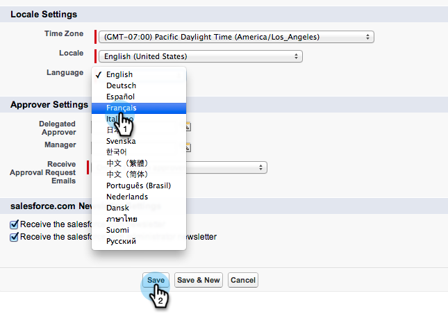

# Preparare Sales Insight per il supporto multilingue in Salesforce {#prepare-sales-insight-for-multi-lingual-support-in-salesforce}

>[!NOTE]
>
>**Autorizzazioni amministratore richieste**

Marketo Sales Insight è memorizzato per lingua. Pertanto, se si desidera che funzioni per più lingue, è necessario immettere le credenziali separatamente per ciascuna lingua.

>[!NOTE]
>
>[!DNL Sales Insight] attualmente supporta:
>
>* Inglese
>* Francese
>* Tedesco
>
>Per impostazione predefinita, qualsiasi altra lingua utilizza l’inglese.

## Aggiunta di una nuova lingua per [!DNL Marketo Sales Insight] {#adding-a-new-language-for-marketo-sales-insight}

1. Accedi a [!DNL Salesforce]. Nell&#39;elenco a discesa sotto il tuo nome nell&#39;angolo in alto a destra, fai clic su **[!UICONTROL Setup]**.

   

1. In **[!UICONTROL My Personal Information]**, fare clic su **[!UICONTROL Personal Information]**.

   

1. Fai clic su **[!UICONTROL Edit]**.

   

1. Selezionare una lingua e fare clic su **[!UICONTROL Save]**.

   

1. L&#39;interfaccia di [!DNL Salesforce] è ora nella lingua selezionata. È possibile fare clic sull&#39;icona **+** per visualizzare tutte le schede disponibili.

   

1. Fare clic su **[!UICONTROL Configure Marketo Sales Insight]** (nella lingua selezionata).

   

1. Passa a Marketo. Individua i tuoi [[!DNL Marketo Sales Insight] **[!UICONTROL API configuration]**dettagli](/help/marketo/product-docs/marketo-sales-insight/msi-for-salesforce/configuration/configure-marketo-sales-insight-in-salesforce-enterprise-unlimited.md#configure-marketo-sales-insight).

   

1. Immettere i dettagli API da Marketo e fare clic su **[!UICONTROL Save]**.

   

## Cambia [!DNL Salesforce] di nuovo in inglese {#change-salesforce-back-to-english}

Dopo aver completato la personalizzazione dell&#39;organizzazione [!DNL Salesforce], ecco come ripristinare la configurazione personale in inglese.

>[!NOTE]
>
>Le seguenti schermate sono in francese con istruzioni in inglese.  Verranno visualizzate le stesse schermate con il testo nella lingua selezionata nel passaggio precedente.

1. Sotto il tuo nome, fai clic su **[!UICONTROL Setup]**.

1. Fare clic su **[!UICONTROL Personal Information]** in **[!UICONTROL My Personal Information]**.

   

1. Fai clic su **[!UICONTROL Edit]**.

   

1. Selezionare **[!UICONTROL English]** dal menu a discesa Lingua e fare clic su **[!UICONTROL Save]**.

   

   Ora il tuo [!DNL Salesforce] è tornato in inglese.
