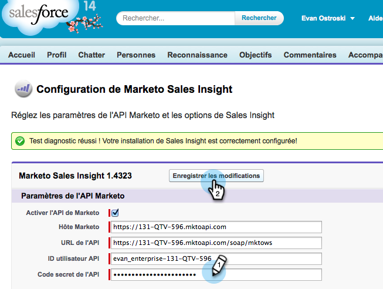

# Prepara approfondimenti sulle vendite per il supporto multilingue in Salesforce {#prepare-sales-insight-for-multi-lingual-support-in-salesforce}

>[!NOTE]
>
>**Autorizzazioni amministratore richieste**

Marketo Sales Insight è memorizzato per lingua. Pertanto, se si desidera che funzioni per più lingue, è necessario immettere le credenziali separatamente per ciascuna lingua.

>[!NOTE]
>
>Sales Insight attualmente supporta:
>
>* Inglese
>* Francese
>* Tedesco
>
>Per impostazione predefinita, qualsiasi altra lingua utilizza l’inglese.

## Aggiunta di una nuova lingua per Marketo Sales Insight {#adding-a-new-language-for-marketo-sales-insight}

1. Accedi a Salesforce. Nell&#39;elenco a discesa sotto il tuo nome nell&#39;angolo in alto a destra, fai clic su **Configurazione**.

   

1. In **Informazioni personali**, fare clic su **Informazioni personali**.

   

1. Fai clic su **Modifica**.

   

1. Selezionare una lingua e fare clic su **Salva**.

   

1. L&#39;interfaccia Salesforce è ora nella lingua selezionata. È possibile fare clic sull&#39;icona **+** per visualizzare tutte le schede disponibili.

   

1. Fare clic su **Configura Marketo Sales Insight** (nella lingua selezionata).

   

1. Passa a Marketo. Individua la [configurazione API di Marketo Sales Insight **** dettagli](/help/marketo/product-docs/marketo-sales-insight/msi-for-salesforce/configuration/configure-marketo-sales-insight-in-salesforce-enterprise-unlimited.md#configure-marketo-sales-insight).

   

1. Immetti i dettagli API da Marketo e fai clic su **Salva**.

   

## Modifica Salesforce ripristinando l’inglese {#change-salesforce-back-to-english}

Una volta completata la personalizzazione dell’organizzazione Salesforce, ecco come ripristinare la configurazione personale in inglese.

>[!NOTE]
>
>Le seguenti schermate sono in francese con istruzioni in inglese.  Verranno visualizzate le stesse schermate con il testo nella lingua selezionata nel passaggio precedente.

1. Sotto il tuo nome, fai clic su **Configurazione**.

1. Fai clic su **Informazioni personali** in **Informazioni personali**.

   

1. Fai clic su **Modifica**.

   

1. Seleziona **Inglese** dal menu a discesa Lingua e fai clic su **Salva**.

   

   Ora la tua Salesforce è tornata in inglese!
