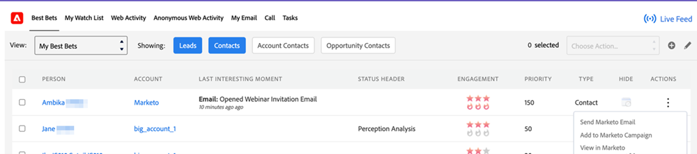

# Migliori offerte {#best-bets}

La scheda Migliori scommesse include un elenco di tutti gli hot lead in base alla loro priorità, calcolato utilizzando l’urgenza e il punteggio relativo.

**Opzioni filtro**

Puoi fare clic su ciascuno dei seguenti pulsanti per vedere Best Bets:

* Lead: Puoi vedere le migliori scommesse per tutti i lead che ti sono stati assegnati nel CRM
* Contatti: Puoi vedere le migliori scommesse per tutti i contatti che ti sono stati assegnati nel CRM
* Contatti account: Puoi vedere le migliori scommesse per tutti i contatti che appartengono ad account assegnati a te nel CRM, anche se il contatto stesso non è assegnato a te
* Contatti opportunità: Puoi vedere le migliori offerte per tutti i contatti che appartengono alle opportunità assegnate nel CRM, anche se il contatto stesso non è assegnato a te

**Aspetti da considerare**

I pulsanti Lead e Contatto sono selezionati per impostazione predefinita. Puoi selezionare una o più opzioni di filtro e dovrai sempre selezionare almeno una delle quattro opzioni.

Non è possibile &quot;nascondere&quot; un lead o un contatto non di proprietà.

**Interazione in linea**

Facendo clic sul menu dei punti nella colonna Azioni , puoi raggiungere un lead o un contatto specifico utilizzando le seguenti opzioni di coinvolgimento:

* Invia e-mail Marketo
* Aggiungi a Marketo Campaign
* Visualizza in Marketo
* Aggiungi a watchlist

**Azioni in blocco**

Puoi selezionare uno o più lead o contatti dalla pagina Best Bets utilizzando la casella di controllo e contattarli come gruppo utilizzando le seguenti opzioni di coinvolgimento:

* Invia e-mail Marketo
* Aggiungi a Marketo Campaign
* Aggiungi a watchlist

