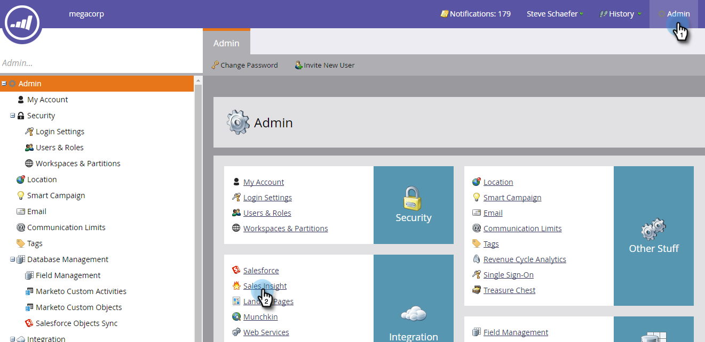

# Abilita RSS per [!DNL Sales Insight] {#enable-rss-for-sales-insight}

>[!NOTE]
>
>**Autorizzazioni amministratore richieste**

Se gli utenti di Marketo desiderano visualizzare il proprio feed di lead non solo in [!DNL Salesforce], ma anche in un feed RSS, un amministratore Marketo deve prima abilitarlo. È facile.

1. In Il mio Marketo, fai clic su **[!UICONTROL Admin]** e quindi su **[!DNL Sales Insight]**.

   

1. In Impostazioni, fare clic su **[!UICONTROL Edit]**. Il feed RSS viene visualizzato come **[!UICONTROL Disabled]**.

   

1. Nella finestra di dialogo [!UICONTROL Edit Settings] selezionare la casella di controllo **[!UICONTROL RSS feed]** e fare clic su **[!UICONTROL Save]**.

   

   Il feed RSS ora viene visualizzato come **[!UICONTROL Enabled]**.

   

   Un pezzo di torta!
