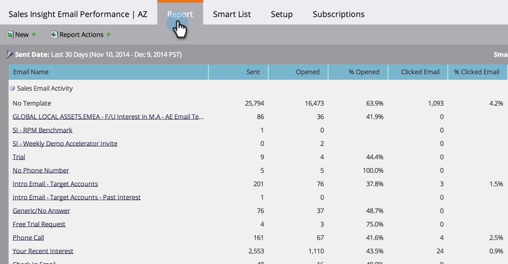

# Rapporto sulle prestazioni delle e-mail di Sales Insight {#sales-insight-email-performance-report}

Visualizza le prestazioni delle e-mail inviate tramite [!DNL Salesforce], [!DNL Microsoft Dynamics] o un plug-in Gmail o [!DNL Outlook].

## Generare un rapporto {#generate-a-report}

1. Fai clic su **[!UICONTROL Analytics]**.

   

1. Fai clic su **[!UICONTROL Sales Insight Email Performance]**.

   

1. Fare clic sulla scheda **[!UICONTROL Setup]** e scegliere i valori desiderati.

   

1. Fai clic sulla scheda **[!UICONTROL Report]**.

   

   Fantastico! Ora puoi vedere le prestazioni delle e-mail inviate dal team di vendita.

   >[!NOTE]
   >
   >Lo stato di consegna non viene acquisito per le e-mail inviate tramite Sales Insight e non verrà incluso in questo rapporto o nei registri attività.

>[!TIP]
>
>Fai clic sul nome di un’e-mail per aprirla in Anteprima e-mail.

## Raggruppa per [!UICONTROL Sales Rep] {#group-by-sales-rep}

È possibile visualizzare questo rapporto raggruppato per rappresentante commerciale modificando le impostazioni.

1. Fai clic su **[!UICONTROL Setup]**. Fare doppio clic su **[!UICONTROL Email]**.

   

1. Seleziona Raggruppa e-mail per **[!UICONTROL Sales Rep]**.

   

1. Fai clic su **[!UICONTROL Save]**.

   

1. Fai clic sulla scheda **[!UICONTROL Report]**.

   

   Fantastico, eh? Ora puoi vedere le prestazioni delle e-mail raggruppate per rappresentante di vendita.
