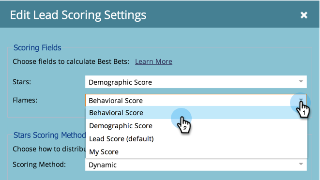
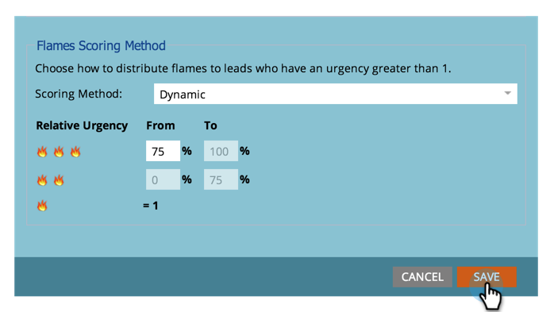

# Imposta i campi punteggio da utilizzare per [!UICONTROL Stars] e [!UICONTROL Flames] in [!DNL Sales Insight] {#set-score-fields-to-be-used-for-stars-and-flames-in-sales-insight}

>[!NOTE]
>
>**Autorizzazioni amministratore richieste**

Per impostazione predefinita, [!DNL Marketo Sales Insight] utilizza il campo **[!UICONTROL Lead Score]** per calcolare stelle e fiamme. Ma se vuoi scegliere un campo diverso, ecco come:

>[!TIP]
>
>Se non disponi già dei campi di punteggio personalizzati, ecco come [crearli](/help/marketo/product-docs/administration/field-management/create-a-custom-field-in-marketo.md).

>[!NOTE]
>
>**Definizione**
>
>* **[!UICONTROL Stars]**: le stelle rappresentano il punteggio di lead totale rispetto ad altri lead.
>* **[!UICONTROL Flames]**: le fiamme rappresentano l&#39;urgenza - quanto il punteggio di un lead è cambiato di recente.
>

1. In **[!UICONTROL Admin]**, fare clic su **[!UICONTROL Sales Insight]**.

   

1. In **[!UICONTROL Lead Scoring Settings]**, fare clic su **[!UICONTROL Edit]**.

   

1. Selezionare il campo da utilizzare per **[!UICONTROL Stars]**.

   

1. Selezionare il campo da utilizzare per **[!UICONTROL Flames]**.

   

1. Fai clic su **[!UICONTROL Save]**.

   

   >[!NOTE]
   >
   >Il ricalcolo di [!DNL Sales insight] richiederà del tempo. Puoi controllare il tuo CRM più tardi per vedere le stelle e le fiamme.

   >[!MORELIKETHIS]
   >
   >[Priorità, Urgenza, Punteggio relativo e Elementi di maggiore rilevanza](/help/marketo/product-docs/marketo-sales-insight/msi-for-salesforce/features/stars-and-flames/priority-urgency-relative-score-and-best-bets.md)
