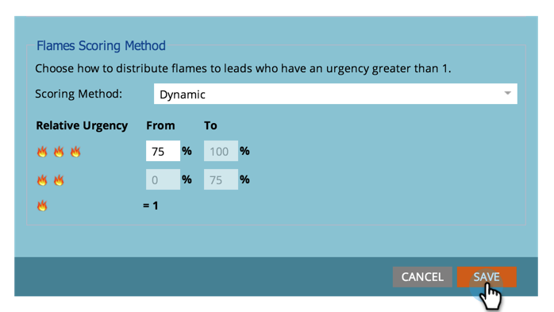

# Imposta i campi punteggio da utilizzare per stelle e fiamme in Sales Insight {#set-score-fields-to-be-used-for-stars-and-flames-in-sales-insight}

>[!NOTE]
>
>**Autorizzazioni amministratore richieste**

Per impostazione predefinita, Marketo Sales Insight utilizza **Punteggio lead** per calcolare le stelle e le fiamme. Ma se vuoi scegliere un campo diverso, ecco come:

>[!TIP]
>
>Se non disponi già dei campi di punteggio personalizzati, ecco come [creare](/help/marketo/product-docs/administration/field-management/create-a-custom-field-in-marketo.md) loro.

>[!NOTE]
>
>**Definizione**
>
>* **Stelle**: le stelle rappresentano il punteggio totale di lead rispetto ad altri lead.
>* **Fiamme**: le fiamme rappresentano l’urgenza - quanto il punteggio di un lead è cambiato di recente.
>

1. Sotto **Amministratore**, fai clic su **Insight sulle vendite**.

   

1. Sotto **Impostazioni punteggio lead**, fai clic su **Modifica**.

   

1. Seleziona il campo da utilizzare per **Stelle**.

   

1. Seleziona il campo da utilizzare per **Fiamme**.

   

1. Clic **Salva**.

   

   >[!NOTE]
   >
   >Il ricalcolo degli approfondimenti sulle vendite richiederà del tempo. Puoi controllare il tuo CRM più tardi per vedere le stelle e le fiamme.

   >[!MORELIKETHIS]
   >
   >[Priorità, urgenza, punteggio relativo e elementi di maggiore rilevanza](/help/marketo/product-docs/marketo-sales-insight/msi-for-salesforce/features/stars-and-flames/priority-urgency-relative-score-and-best-bets.md)
