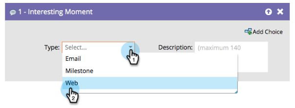

# Panoramica dei momenti di interesse {#interesting-moments-overview}

Puoi usare il passaggio del flusso di momento interessante per dare visibilità al team di vendita sulle cose interessanti che i lead stanno facendo in una campagna intelligente.

>[!AVAILABILITY]
>
>Per utilizzare i momenti interessanti è necessario essere un utente [!DNL Marketo Sales Insight] o [[!DNL Marketo Sales Connect]](/help/marketo/product-docs/marketo-sales-connect/marketo/interesting-moments-in-sales-connect.md).

1. Seleziona il tipo di momento di interesse da utilizzare.

   

1. Definisci il testo da mostrare al team vendite.

   

>[!TIP]
>
>**Meno è più**. Collabora con il tuo sales team per assicurarti che i momenti interessanti siano davvero interessanti.

Puoi anche utilizzare i token in momenti interessanti per creare descrizioni dinamiche molto utili.

>[!MORELIKETHIS]
>
>* [Utilizzo di momenti di interesse](/help/marketo/product-docs/marketo-sales-insight/msi-for-salesforce/features/tabs-in-the-msi-panel/interesting-moments/using-interesting-moments.md)
>* [Token per i momenti di interesse](/help/marketo/product-docs/marketo-sales-insight/msi-for-salesforce/features/tabs-in-the-msi-panel/interesting-moments/trigger-tokens-for-interesting-moments.md)
