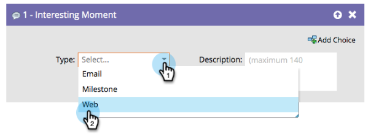

# Panoramica sui momenti interessanti {#interesting-moments-overview}

Puoi utilizzare l&#39;interessante fase di flusso del momento per dare visibilità al tuo team di vendita sugli aspetti interessanti che i lead stanno facendo in una Smart Campaign.

1. Selezionate il tipo di momento interessante da usare.

   

1. Definite il testo che desiderate venga visualizzato dal team di vendita.

   

>[!TIP]
>
>**Meno è di più**. Collabora con il team di vendita per essere certi che i momenti interessanti siano davvero interessanti.

Potete anche utilizzare i token in momenti interessanti per ottenere descrizioni dinamiche molto utili.

>[!MORELIKETHIS]
>
>* [Utilizzo di momenti interessanti](using-interesting-moments.md)
>* [Token per momenti interessanti](tokens-for-interesting-moments.md)

>

