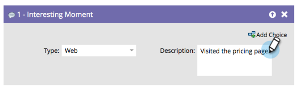

# Panoramica dei momenti interessanti {#interesting-moments-overview}

Puoi utilizzare l’interessante passaggio di flusso del momento per dare visibilità al tuo team di vendita sugli aspetti interessanti che i tuoi lead stanno facendo in una Smart Campaign.

1. Seleziona il tipo di momento interessante da utilizzare.

   

1. Definisci il testo da visualizzare al team di vendita.

   

>[!TIP]
>
>**Meno è più**. Collabora con il tuo team di vendita per assicurarsi che i momenti interessanti siano effettivamente interessanti.

Puoi anche utilizzare i token in momenti interessanti per ottenere descrizioni dinamiche molto utili.

>[!MORELIKETHIS]
>
>* [Utilizzo di momenti interessanti](/help/marketo/product-docs/marketo-sales-insight/msi-for-salesforce/features/tabs-in-the-msi-panel/interesting-moments/using-interesting-moments.md)
>* [Token per momenti interessanti](/help/marketo/product-docs/marketo-sales-insight/msi-for-salesforce/features/tabs-in-the-msi-panel/interesting-moments/trigger-tokens-for-interesting-moments.md)

