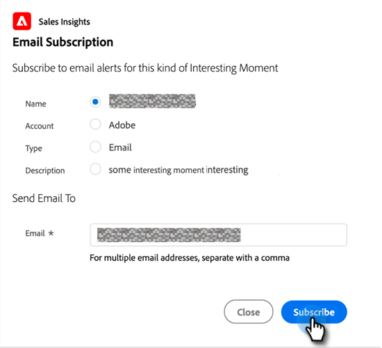

# Utilizzo di momenti interessanti {#using-interesting-moments}

I momenti interessanti sono la chiave per comunicare con il tuo team di vendita tramite l’app Marketo Sales Insight.

>[!AVAILABILITY]
>
>Sono disponibili per Marketo Sales Insight e [Marketo Sales Connect](/help/marketo/product-docs/marketo-sales-connect/marketo/interesting-moments-in-sales-connect.md) solo clienti.

## Qual è un momento interessante? {#what-is-an-interesting-moment}

Sta a te decidere! Decidi quali informazioni sono rilevanti per il tuo team di vendita. Il tuo team di vendita potrebbe voler sapere quando un lead:

* Visita la pagina dei prezzi sul sito Web
* Fa clic su un collegamento in un messaggio e-mail di annuncio di un nuovo prodotto.
* Richiede una demo del prodotto

## Come posso creare un momento interessante?  {#how-do-i-create-an-interesting-moment}

1. Scegli un [campagna intelligente](/help/marketo/product-docs/core-marketo-concepts/smart-campaigns/understanding-smart-campaigns.md), preferibilmente uno che il tuo team di vendita troverebbe interessante se attivato.

   

1. Trascina sulla **Momenti di interesse** passaggio di flusso.

   

1. Seleziona un **tipo** (E-mail, Milestone o Web).

   

1. Scrivi un messaggio al tuo team vendite nella sezione **Descrizione** che spiega perché questa azione è importante.

   

   >[!NOTE]
   >
   >Marketo aggiungerà anche la data in cui si è verificato e come è stato aggiunto il momento interessante (ad esempio azione lead > passaggio di flusso, API SOAP).

## Come può diventare ancora più interessante?  {#how-can-this-get-even-more-interesting}

Token! Aggiungili nel campo di descrizione per fornire al team di vendita informazioni più specifiche, ad esempio l’oggetto dell’e-mail aperta dal lead o chi l’ha inviata. Scopri quali token sono disponibili per l’utilizzo in [Token per i momenti di interesse](/help/marketo/product-docs/marketo-sales-insight/msi-for-salesforce/features/tabs-in-the-msi-panel/interesting-moments/trigger-tokens-for-interesting-moments.md) glossario.

>[!TIP]
>
>Inizia con cinque momenti interessanti, quindi collabora con il tuo team di vendita per determinare quali informazioni sono interessati a vedere.

## Come appare un momento interessante in Marketo?  {#what-does-an-interesting-moment-look-like-in-marketo}

I momenti interessanti verranno visualizzati in una [registro attività del lead](/help/marketo/product-docs/core-marketo-concepts/smart-lists-and-static-lists/managing-people-in-smart-lists/using-the-person-detail-page.md).

## Che aspetto ha un momento interessante in Salesforce?  {#what-does-an-interesting-moment-look-like-in-salesforce}

Una volta [ha installato Marketo Sales Insight App](/help/marketo/product-docs/marketo-sales-insight/msi-for-salesforce/configuration/configure-marketo-sales-insight-in-salesforce-enterprise-unlimited.md), i momenti di interesse verranno visualizzati sulle pagine di lead, contatti, account o opportunità. Vengono inoltre visualizzate nel dashboard approfondimenti vendite nell’elenco Feed lead, Elementi di maggiore rilevanza e Osserva.

## Come si presenta un momento interessante in Salesforce1? {#what-does-an-interesting-moment-look-like-in-salesforce-1}

Dopo aver installato o aggiornato Marketo Sales Insight per Salesforce1, i momenti interessanti verranno visualizzati nei collegamenti correlati del lead.

## Iscriviti ai momenti di interesse {#subscribe-to-interesting-moments}

Per iscriverti a un momento di interesse, fai clic sul pulsante Abbonati nella scheda Momento di interesse o nel Feed lead. I passaggi seguenti sono gli stessi per entrambi.

1. Fai clic sull’icona Sottoscrivi. Passerai quindi alla scheda Iscrizione e-mail.

1. Puoi scegliere il tipo di avviso e-mail da ricevere in base a Nome, Account, Tipo o Descrizione.

1. Scegli gli indirizzi e-mail a cui inviare gli avvisi (te stesso/i membri del gruppo)

1. Clic **Abbonati**.

>[!NOTE]
>
>Con l’abbonamento a Tipi di momento di interesse o Descrizioni, l’utente riceverà notifiche e-mail per le persone (lead/contatti) di cui è proprietario quando attiva un Momento di interesse che corrisponde a quel Tipo o Descrizione.

