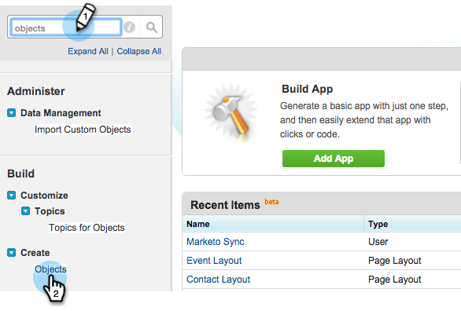

# Installazione del pacchetto marketing Sales Insight in Salesforce  AppExchange {#install-marketo-sales-insight-package-in-salesforce-appexchange}

Devi installare l&#39;app Marketing Sales Insight nel tuo abbonamento Salesforce prima di poter usufruire di tutte le informazioni sulla vendita di prodotti di buona qualità. Ecco come.

>[!NOTE]
>
>**Autorizzazioni amministratore richieste**

>[!NOTE]
>
>Marketing Sales Insight è compatibile con la crittografia della piattaforma Salesforce (Shield).

1. Vai alla pagina [ AppExchange per Marketing Sales Insight](https://appexchange.salesforce.com/listingDetail?listingId=a0N30000001SVZmEAO) e fai clic su **Get Now** (Ottieni ora).

   

1. Fai clic su **Accedi al pulsante AppExchange** ed effettua l&#39;accesso con le tue credenziali Salesforce.

1. Immetti il login dell&#39;account Salesforce collegato e fai clic su **Installa in produzione**.

   

   >[!TIP]
   >
   >Se prima desiderate eseguire il test out nella sandbox, scegliete **Installa in sandbox**.

1. Leggi e accetta i termini e le condizioni, quindi fai clic su **Conferma e installa**.

   

1. Potete scegliere &quot;Installa solo per amministratori&quot; (e fornire l&#39;accesso MSI a profili specifici in un secondo momento), &quot;Installa per tutti gli utenti&quot; o, &quot;Installa per profili specifici&quot;.

   

1. Una volta avviato il processo di installazione, potrebbe venire visualizzato il messaggio seguente. Una volta completata l&#39;installazione, riceverete un messaggio e-mail. Fare clic su **Fine** per chiudere.

   

1. Verificare che **Marketing Sales Insight** sia nei pacchetti installati.

   

1. Fare clic su **Setup** accanto al nome.

   

1. Cercare &quot;oggetti&quot;, quindi fare clic su **Oggetti** in **Crea**.

   

1. Verificare che **Deployed** sia selezionato per tutti gli articoli di Marketing Sales Insight.

   

1. Se un oggetto non è distribuito, fare clic su **Modifica** accanto all&#39;elemento.

   

1. Nella sezione **Stato distribuzione**, selezionare **Distribuito**, quindi fare clic su **Salva**.

   

Ottimo lavoro! Ora hai installato e implementato Marketing Sales Insight. Vai avanti e configuralo per il tuo team di vendita e guarda il razzo di vendita.

>[!MORELIKETHIS]
>
>[Configurare Marketing Sales Insight in Salesforce Professional Edition](/help/marketo/product-docs/marketo-sales-insight/msi-for-salesforce/configuration/configure-marketo-sales-insight-in-salesforce-professional-edition.md)
>
>[Configurare Marketing Sales Insight in Salesforce Enterprise/Unlimited](/help/marketo/product-docs/marketo-sales-insight/msi-for-salesforce/configuration/configure-marketo-sales-insight-in-salesforce-enterprise-unlimited.md)
