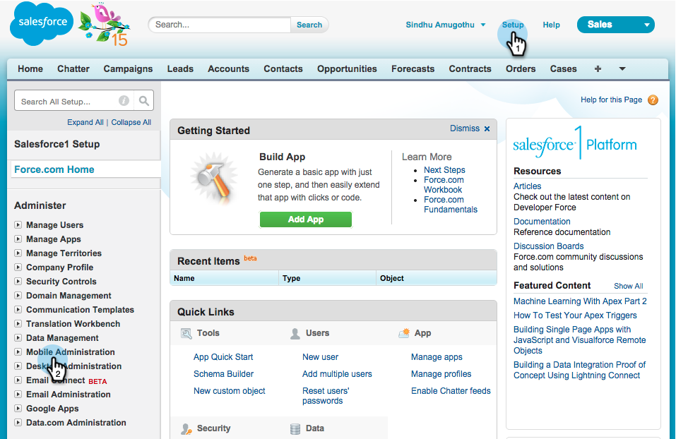
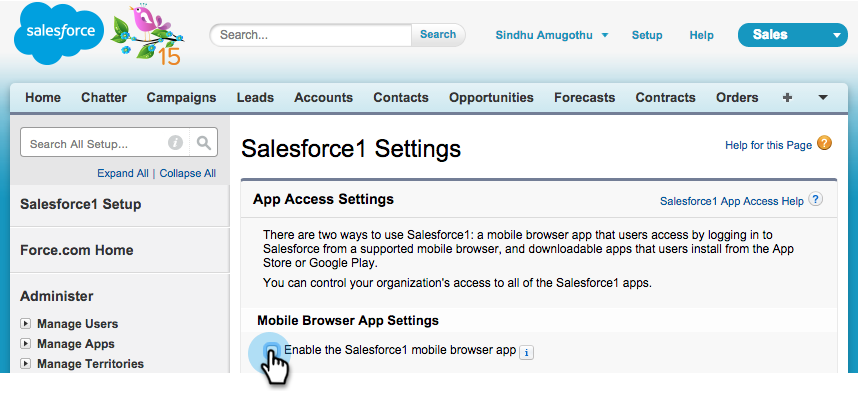
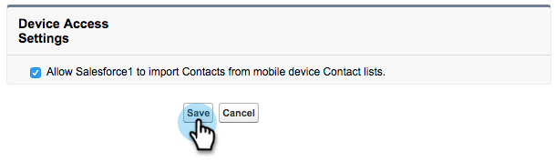

# Installare e configurare Marketo Sales Insight in Salesforce1 {#install-and-configure-marketo-sales-insight-in-salesforce}

>[!NOTE]
>
>Clienti esistenti, per favore [Aggiornamento del pacchetto MSI](/help/marketo/product-docs/marketo-sales-insight/msi-for-salesforce/upgrading/upgrading-your-msi-package.md) prima di continuare.

>[!PREREQUISITES]
>
>Se hai Salesforce Enterprise/Unlimited:
>
>* [Passaggio 1 di 3: aggiunta di campi Marketo a Salesforce (Enterprise/Unlimited)](/help/marketo/product-docs/crm-sync/salesforce-sync/setup/enterprise-unlimited-edition/step-1-of-3-add-marketo-fields-to-salesforce-enterprise-unlimited.md)
>* [Passaggio 2 di 3: creare un utente Salesforce per Marketo (Enterprise/Unlimited)](/help/marketo/product-docs/crm-sync/salesforce-sync/setup/enterprise-unlimited-edition/step-2-of-3-create-a-salesforce-user-for-marketo-enterprise-unlimited.md)
>* [Passaggio 3 di 3: Connessione di Marketo e Salesforce (Enterprise/Unlimited)](/help/marketo/product-docs/crm-sync/salesforce-sync/setup/enterprise-unlimited-edition/step-3-of-3-connect-marketo-and-salesforce-enterprise-unlimited.md)
>* [Configurare Marketo Sales Insight in Salesforce Enterprise/Unlimited](/help/marketo/product-docs/marketo-sales-insight/msi-for-salesforce/configuration/configure-marketo-sales-insight-in-salesforce-enterprise-unlimited.md)
>
>Se si dispone di Salesforce Professional:
>
>* [Configurare Marketo Sales Insight in Salesforce Professional Edition](/help/marketo/product-docs/marketo-sales-insight/msi-for-salesforce/configuration/configure-marketo-sales-insight-in-salesforce-professional-edition.md)
>

>[!NOTE]
>
>Marketo Sales Insight in Salesforce1 include: elementi di maggiore rilevanza, feed di lead, momenti di interesse e Aggiungi a Marketo Campaign.

## Abilitare l’app mobile Salesforce1 {#enable-the-salesforce1-mobile-app}

1. Clic **Configurazione** e poi **Amministrazione dispositivi mobili**.

   

1. Clic **Salesforce1**.

   

1. Clic **Impostazioni Salesforce1**.

   

1. Clic **Abilita l’app del browser mobile Salesforce1**.

   

1. Clic **Salva**.

   

1. Seleziona **Amministrazione dispositivi mobili**.

   

1. Clic **Gestire il menu di navigazione mobile**.

   

1. Seleziona **Marketo** e **Aggiungi** al **Selezionato** voci di menu.

   

1. Seleziona **Marketo**, spostalo **Su** nell&#39;area desiderata, quindi fare clic su **Salva**.

   

## Nascondi oggetto personalizzato Marketo obsoleto {#hide-outdated-marketo-custom-object}

1. Clic **Configurazione**.

   

1. Seleziona **Gestisci utenti**.

   

1. Seleziona **Profili**.

   

1. Fai clic per **modifica** eventuali profili desiderati.

   

1. Sotto **Impostazioni scheda**, seleziona la _primo_ **Marketo**.

   

1. Seleziona **Scheda nascosta**.

   

   >[!NOTE]
   >
   >Assicurati di nascondere la scheda Marketo per tutti i profili desiderati.

## Personalizza schede {#customize-tabs}

1. Clic **+**.

   

1. Clic **Personalizza schede personali**.

   

1. Seleziona **Marketo** e **Aggiungi** alle schede selezionate.

   

1. Seleziona **Marketo**, spostalo **Su** nell&#39;area desiderata, quindi fare clic su **Salva**.

   

## Personalizza layout di pagina {#customize-page-layouts}

1. Clic **Configurazione**.

   

1. Clic **Configurazione**, tipo **Layout di pagina** e fai clic su **Layout di pagina** in Lead.

   >[!NOTE]
   >
   >Ripeti i passaggi per ogni layout di pagina utilizzato dalla tua organizzazione (marketing, vendite, ecc.) per gli oggetti Contact, Account e Opportunity.

   

1. Clic **Modifica** per apportare modifiche al layout del lead.

   

1. Clic **Visualforce Pages** e quindi trascina **Cellulare lead** nella sezione Schede mobili.

   

1. Impostate Altezza (Height) a 66 e fate clic su **OK**.

   

1. Clic **Campi** e trascina **Aggiungi a Marketo Campaign** al **Insight sulla vendita di Marketo** sezione.

   

   >[!TIP]
   >
   >Digita &quot;Aggiungi a&quot; nella Ricerca rapida per facilitare la ricerca di Aggiungi a Marketo Campaign.

1. Clic **Salva**.

   

Meno male! Installazione di Marketo Sales Insight per Salesforce1 completata. Vada avanti e si dia una pacca sulla schiena.

>[!MORELIKETHIS]
>
>* [Elementi di maggiore rilevanza in Salesforce1](/help/marketo/product-docs/marketo-sales-insight/msi-for-salesforce/msi-for-mobile/best-bets-in-salesforce1.md)
>* [Momenti interessanti in Salesforce1](/help/marketo/product-docs/marketo-sales-insight/msi-for-salesforce/msi-for-mobile/interesting-moments-in-salesforce1.md)
>* [Inviare azioni e-mail e campagne Marketo e watchlist in Salesforce1](/help/marketo/product-docs/marketo-sales-insight/msi-for-salesforce/msi-for-mobile/send-marketo-email-and-campaign-and-watchlist-actions-in-salesforce1.md)
