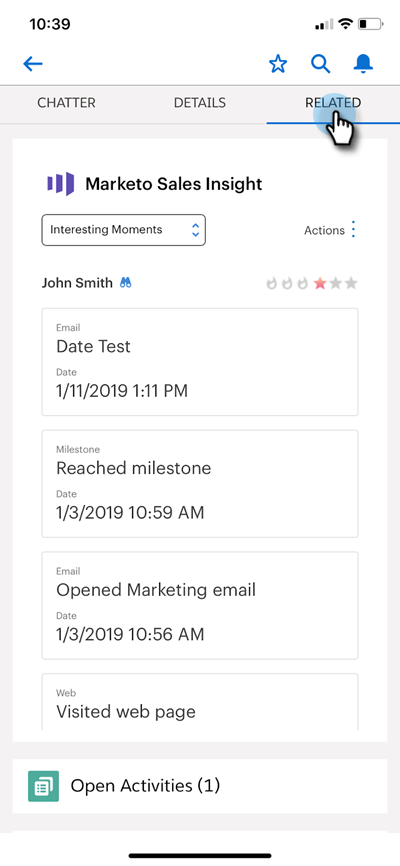

# Momenti interessanti in Salesforce1 {#interesting-moments-in-salesforce}

[Utilizzando ](/help/marketo/product-docs/marketo-sales-insight/msi-for-salesforce/features/tabs-in-the-msi-panel/interesting-moments/using-interesting-moments.md) Momentsis interessante è possibile comunicare con il team di vendita tramite l&#39;app Marketo Sales Insight. Ora, con Marketo Sales Insight per Salesforce1, puoi fare lo stesso con il tuo smartphone!

>[!AVAILABILITY]
>
>Sono disponibili solo per i clienti Marketo Sales Insight .

1. Sul tuo smartphone, apri l&#39;app Salesforce.

1. Passa a un lead.

   

1. Fai clic sulla scheda **Correlati** per visualizzare Momenti interessanti, attività web, e-mail e punteggio.

   

>[!MORELIKETHIS]
>
>* [Momento interessante](/help/marketo/product-docs/core-marketo-concepts/smart-campaigns/flow-actions/interesting-moment.md)
>* [Token per momenti interessanti](/help/marketo/product-docs/marketo-sales-insight/msi-for-salesforce/features/tabs-in-the-msi-panel/interesting-moments/trigger-tokens-for-interesting-moments.md)

