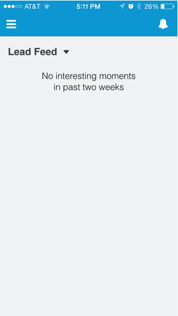

# Visualizzazione del feed di lead in [!DNL Salesforce1] {#seeing-lead-feed-in-salesforce}

Il feed di lead è un elenco aggiornato di eventi interessanti creati dai lead.

1. Vai all&#39;area **Marketo** in [!DNL Salesforce1].

   

1. Tocca la freccia giù.

   

1. Toccare **[!UICONTROL Lead Feed]**.

   

   Perfetto! Ora sai come arrivare al tuo feed di lead!

   

>[!MORELIKETHIS]
>
>* [Momenti di interesse in [!DNL Salesforce1]](/help/marketo/product-docs/marketo-sales-insight/msi-for-salesforce/msi-for-mobile/interesting-moments-in-salesforce1.md)
>* [Invia azioni e-mail e campagne Marketo e watchlist in [!DNL Salesforce1]](/help/marketo/product-docs/marketo-sales-insight/msi-for-salesforce/msi-for-mobile/send-marketo-email-and-campaign-and-watchlist-actions-in-salesforce1.md)
>* [[!DNL Best Bets] in [!DNL Salesforce1]](/help/marketo/product-docs/marketo-sales-insight/msi-for-salesforce/msi-for-mobile/best-bets-in-salesforce1.md)
