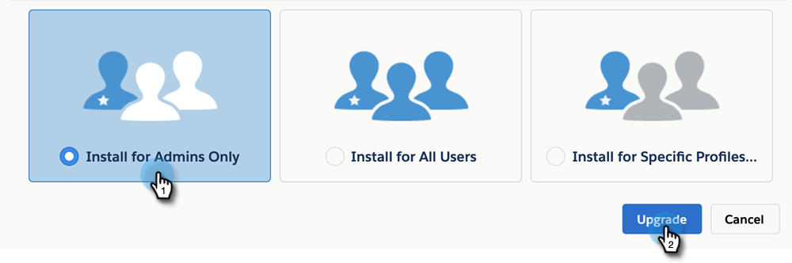

# Aggiornamento del pacchetto MSI {#upgrading-your-msi-package}

1. Accedi a [questa pagina in appexchange](https://appexchange.salesforce.com/listingDetail?listingId=a0N30000001SVZmEAO){target="_blank"}.

1. Accedi all’istanza Salesforce (quella connessa alla tua istanza Marketo, che può essere sandbox o produzione) dall’angolo in alto a destra della pagina dal passaggio 1. Per installare/aggiornare un pacchetto gestito in Salesforce è necessario disporre dei privilegi di amministratore.

1. Fai clic su **Ottieni subito** pulsante. Ti verrà chiesto di scegliere dove desideri installare. Potrai effettuare l&#39;aggiornamento poiché disponi già di una versione precedente di MSI. Scegli un’opzione in base all’account a cui hai effettuato l’accesso durante il passaggio 1.

   >[!TIP]
   >
   >È consigliabile eseguire un test nell’istanza sandbox prima di aggiornare l’istanza di produzione.

1. Per aggiornare il pacchetto, scegli &quot;Installa solo per amministratori&quot; (e fornisci l’accesso MSI a profili specifici in un secondo momento), &quot;Installa per tutti gli utenti&quot; o &quot;Installa per profili specifici&quot;. In questo esempio stiamo scegliendo Solo amministratori. Dopo aver effettuato la selezione, fai clic su **Aggiorna**.

   

>[!NOTE]
>
>Si consiglia di aggiornare il pacchetto solo per gli amministratori e quindi [fornire accesso a utenti specifici](/help/marketo/product-docs/marketo-sales-insight/msi-for-salesforce/configuration/add-sales-insight-access-to-profiles.md){target="_blank"} in base al numero di posti MSI acquistati. In alternativa, puoi creare un profilo Salesforce specifico per gli utenti MSI e installare o aggiornare il pacchetto solo per tali utenti.
