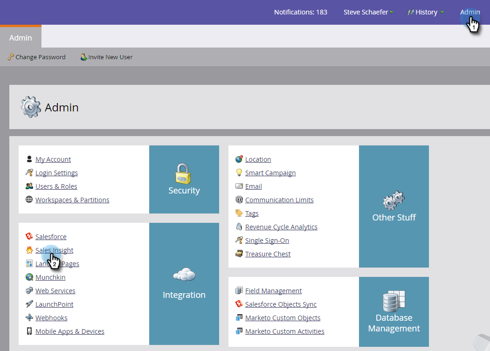

# Installare il componente aggiuntivo Marketo per Outlook con una chiave Enterprise {#install-the-marketo-add-in-for-outlook-with-an-enterprise-key}

Spesso i rappresentanti commerciali non dispongono di privilegi amministrativi sui notebook e i loro team IT sono responsabili dell&#39;installazione di tutto il software in remoto. Il componente aggiuntivo Marketo per Outlook può essere installato in questo modo utilizzando la chiave Enterprise, disponibile nella sezione Sales Insight di Admin. Se non viene visualizzato il pulsante Visualizza chiave organizzazione, contattare [Supporto Marketo](https://nation.marketo.com/t5/Support/ct-p/Support) per abilitarlo.

>[!PREREQUISITES]
>
>L’amministratore deve avere [ha emesso una licenza di Marketo Email Add-In](/help/marketo/product-docs/marketo-sales-insight/msi-outlook-plugin/issue-a-marketo-email-add-in-license.md).

>[!NOTE]
>
>Le funzionalità delle azioni di approfondimento delle vendite, tra cui Invia e-mail alle vendite, Aggiungi a campagna di vendita e Attività, non sono disponibili nei plug-in e-mail di approfondimento delle vendite per Gmail e Outlook. Al momento, gli utenti possono inviare un’e-mail tracciabile solo con o senza un modello e-mail di Marketo dal proprio client e-mail quando utilizzano i plug-in e-mail di Sales Insight.

1. In Il mio Marketo, fai clic su **Amministratore** e poi **Insight sulle vendite**.

   

1. Fai clic su **Componente aggiuntivo e-mail** scheda.

   

1. Clic **Visualizza chiave Enterprise**.

   

1. Copiare il codice di licenza Enterprise di Outlook e incollarlo in un messaggio e-mail, insieme a [questo collegamento](/help/marketo/product-docs/marketo-sales-insight/msi-outlook-plugin/marketo-outlook-plugin-installation-by-it.md)e inviarli al reparto IT per l&#39;installazione remota.

   

   Tutto qui! Successivamente, il rappresentante commerciale [processo di registrazione](/help/marketo/product-docs/marketo-sales-insight/msi-outlook-plugin/authorize-the-marketo-outlook-plugin.md).
