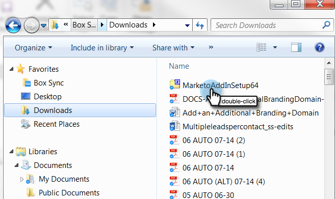

# Installare il componente aggiuntivo Marketo Email per Outlook con un codice di registrazione {#install-the-marketo-email-add-in-for-outlook-with-a-registration-code}

Se gli utenti possono accedere alle impostazioni dell&#39;amministratore sul proprio laptop, puoi inviare loro direttamente un codice di registrazione.

Se non hai ricevuto un messaggio e-mail di invito, chiedi al tuo amministratore Marketo di invitarti.

>[!PREREQUISITES]
>
>Devi essere [ha rilasciato una licenza del componente aggiuntivo per e-mail di Marketo](/help/marketo/product-docs/marketo-sales-insight/msi-outlook-plugin/issue-a-marketo-email-add-in-license.md).

>[!IMPORTANT]
>
>L&#39;installazione non è supportata nei PC in cui la cartella Utente di Windows contiene caratteri non inglesi. Questa cartella viene generata automaticamente da Windows in <System Root>\Users\ in base al nome utente di Windows e può contenere caratteri non inglesi se il nome utente di Windows è un nome non inglese. Rivolgiti al tuo team IT per verificare se riscontri problemi di installazione.

>[!NOTE]
>
>Il 20/1/10, la versione più recente del plug-in di Outlook non supporta più la modalità offline.

## Download del programma di installazione {#download-installer}

1. Identifica le [Versione di Microsoft Outlook](https://support.office.com/en-us/article/what-version-of-outlook-do-i-have-b3a9568c-edb5-42b9-9825-d48d82b2257c)

1. Fare clic sul collegamento per scaricare il programma di installazione appropriato per la versione di Microsoft Outlook.

   >[!NOTE]
   >
   >Al momento, i collegamenti riportati di seguito funzionano solo in Microsoft Edge o facendo clic con il pulsante destro del mouse in Chrome. Mi scuso di eventuali inconvenienti.

   | Versione di Outlook | Outlook a 32 bit | Outlook a 64 bit |
   |---|---|---|
   | Outlook 2000 | Non supportato | N/D |
   | Outlook 2003 | [Scarica](https://munchkin.marketo.net/MarketoAddInSetup32.msi) | N/D |
   | Outlook 2007 | [Scarica](https://munchkin.marketo.net/MarketoAddInSetup32.msi) | N/D |
   | Outlook 2010 | [Scarica](https://munchkin.marketo.net/MarketoAddInSetup32.msi) | [Scarica](https://munchkin.marketo.net/MarketoAddInSetup64.msi) |
   | Outlook 2013 | [Scarica](https://munchkin.marketo.net/MarketoAddInSetup32.msi) | [Scarica](https://munchkin.marketo.net/MarketoAddInSetup64.msi) |
   | Outlook 2016 | [Scarica](https://munchkin.marketo.net/MarketoAddInSetup32.msi) | [Scarica](https://munchkin.marketo.net/MarketoAddInSetup64.msi) |
   | Outlook 2019 | [Scarica](https://munchkin.marketo.net/MarketoAddInSetup32.msi) | [Scarica](https://munchkin.marketo.net/MarketoAddInSetup64.msi) |
   | Outlook per Mac | Non supportato | Non supportato |
   | App Web di Outlook | Non supportato | Non supportato |
   | Office 365* | [Scarica](https://munchkin.marketo.net/MarketoAddInSetup32.msi) | [Scarica](https://munchkin.marketo.net/MarketoAddInSetup64.msi) |

   *Versione Office 365: Solo client Windows (su Windows 10, Enterprise o Pro).

## Copia il tuo codice di registrazione {#copy-your-registration-code}

1. Copia il codice di registrazione dal messaggio e-mail di invito ricevuto.

   

1. Chiudere Microsoft Outlook.

   

## Installa {#install}

1. Esegui il programma di installazione.

   

   >[!NOTE]
   >
   >Se ricevi un avviso di sicurezza, non ti preoccupare! Fai clic su **Esegui**.

1. Fai clic su **Successivo**.

   

1. Riempi **Nome**, **Cognome**, **Indirizzo e-mail**, quindi copia e incolla il **Codice di registrazione** dall’e-mail al modulo e fai clic su **Successivo**.

   

   >[!TIP]
   >
   >Se l&#39;installazione non riesce, controlla con il tuo reparto IT per assicurarti che il traffico HTTPS non sia bloccato. Il programma di installazione richiede l’apertura del traffico HTTPS.

1. Fai clic su **Successivo** da installare nel percorso predefinito.

   

1. Fai clic su **Successivo**.

   

   >[!NOTE]
   >
   >Se ricevi una richiesta di protezione su un editore sconosciuto, fai clic su **Sì**.

1. L&#39;installazione è stata completata, fai clic su **Chiudi**.

   

1. Ora aprire Microsoft Outlook e vedere i pulsanti Marketo.

   

   Eccellente! Ora i pulsanti Marketo sono in un posto migliore.

Ulteriori informazioni sull&#39;utilizzo delle azioni Messaggio Marketo e Registro con Marketo.

>[!MORELIKETHIS]
>
>* [Inviare e tenere traccia di un messaggio e-mail con il componente aggiuntivo e-mail Marketo per Outlook](/help/marketo/product-docs/marketo-sales-insight/msi-outlook-plugin/send-and-track-an-email-with-the-email-add-in-for-outlook.md)
>* [Invia e tieni traccia da Outlook utilizzando un modello Marketo](/help/marketo/product-docs/marketo-sales-insight/msi-outlook-plugin/send-and-track-from-outlook-using-a-marketo-template.md)

