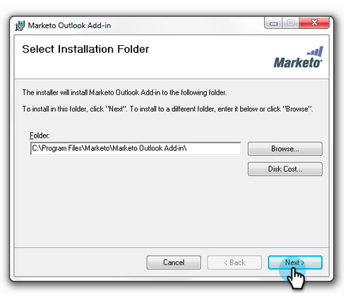

# Aggiornare il componente aggiuntivo e-mail Marketo per Outlook {#upgrade-your-marketo-email-add-in-for-outlook}

Quando è disponibile una nuova versione del componente aggiuntivo e-mail Marketo per Outlook, segui queste istruzioni per eseguire l&#39;aggiornamento.

>[!NOTE]
>
>A partire dal 20/1/10, la versione più recente del plug-in di Outlook non supporta più la modalità offline. Questo avrà effetto dopo l&#39;installazione/aggiornamento il o dopo 10/1.

## Download del programma di installazione {#download-installer}

Scaricare il programma di installazione appropriato per la versione di Microsoft Outlook.

<table> 
 <colgroup> 
  <col> 
  <col> 
  <col> 
  <col> 
  <col> 
 </colgroup> 
 <tbody> 
  <tr> 
   <th> </th> 
   <th colspan="2">Installazione di inviti utente singoli</th> 
   <th colspan="2">Installazione a chiave aziendale</th> 
  </tr> 
  <tr> 
   <td><strong>Versione di Outlook</strong></td> 
   <td><strong>32 bit</strong></td> 
   <td><strong>64 bit</strong></td> 
   <td><strong>32 bit</strong></td> 
   <td><strong>64 bit</strong></td> 
  </tr> 
  <tr> 
   <td>Outlook 2000</td> 
   <td>Non supportato</td> 
   <td>N/D</td> 
   <td>Non supportato</td> 
   <td>N/D</td> 
  </tr> 
  <tr> 
   <td>Outlook 2003</td> 
   <td><a href="https://munchkin.marketo.net/MarketoAddInSetup32.msi" rel="nofollow">Scarica</a></td> 
   <td>N/D</td> 
   <td>Non supportato</td> 
   <td>N/D</td> 
  </tr> 
  <tr> 
   <td>Outlook 2007</td> 
   <td><a href="https://munchkin.marketo.net/MarketoAddInSetup32.msi" rel="nofollow">Scarica</a></td> 
   <td>N/D</td> 
   <td>Non supportato</td> 
   <td>N/D</td> 
  </tr> 
  <tr> 
   <td>Outlook 2010</td> 
   <td><a href="https://munchkin.marketo.net/MarketoAddInSetup32.msi" rel="nofollow">Scarica</a></td> 
   <td><a href="https://munchkin.marketo.net/MarketoAddInSetup64.msi" rel="nofollow">Scarica</a></td> 
   <td><a href="https://munchkin.marketo.net/MarketoAddInSetup32.msi" rel="nofollow">Scarica</a></td> 
   <td><a href="https://munchkin.marketo.net/MarketoAddInSetup64.msi" rel="nofollow">Scarica</a></td> 
  </tr> 
  <tr> 
   <td>Outlook 2013</td> 
   <td><a href="https://munchkin.marketo.net/MarketoAddInSetup32.msi" rel="nofollow">Scarica</a></td> 
   <td><a href="https://munchkin.marketo.net/MarketoAddInSetup64.msi" rel="nofollow">Scarica</a></td> 
   <td><a href="https://munchkin.marketo.net/MarketoAddInSetup32.msi" rel="nofollow">Scarica</a></td> 
   <td><a href="https://munchkin.marketo.net/MarketoAddInSetup64.msi" rel="nofollow">Scarica</a></td> 
  </tr> 
  <tr> 
   <td>Outlook 2016</td> 
   <td><a href="https://munchkin.marketo.net/MarketoAddInSetup32.msi" rel="nofollow">Scarica</a></td> 
   <td><a href="https://munchkin.marketo.net/MarketoAddInSetup64.msi" rel="nofollow">Scarica</a></td> 
   <td><a href="https://munchkin.marketo.net/MarketoAddInSetup32.msi" rel="nofollow">Scarica</a></td> 
   <td><a href="https://munchkin.marketo.net/MarketoAddInSetup64.msi" rel="nofollow">Scarica</a></td> 
  </tr> 
  <tr> 
   <td colspan="1">Outlook 2019</td> 
   <td colspan="1"><a href="https://munchkin.marketo.net/MarketoAddInSetup32.msi" rel="nofollow">Scarica</a></td> 
   <td colspan="1"><a href="https://munchkin.marketo.net/MarketoAddInSetup64.msi" rel="nofollow">Scarica</a></td> 
   <td colspan="1"><a href="https://munchkin.marketo.net/MarketoAddInSetup32.msi" rel="nofollow">Scarica</a></td> 
   <td colspan="1"><a href="https://munchkin.marketo.net/MarketoAddInSetup64.msi" rel="nofollow">Scarica</a></td> 
  </tr> 
  <tr> 
   <td>Outlook per Mac</td> 
   <td>Non supportato</td> 
   <td>Non supportato</td> 
   <td>Non supportato</td> 
   <td>Non supportato</td> 
  </tr> 
  <tr> 
   <td colspan="1">App Web di Outlook</td> 
   <td colspan="1">Non supportato</td> 
   <td colspan="1">Non supportato</td> 
   <td colspan="1">Non supportato</td> 
   <td colspan="1">Non supportato</td> 
  </tr> 
  <tr> 
   <td colspan="1">Office 365*</td> 
   <td colspan="1"><a href="https://munchkin.marketo.net/MarketoAddInSetup32.msi" rel="nofollow">Scarica</a></td> 
   <td colspan="1"><a href="https://munchkin.marketo.net/MarketoAddInSetup64.msi" rel="nofollow">Scarica</a></td> 
   <td colspan="1"><a href="https://munchkin.marketo.net/MarketoAddInSetup32.msi" rel="nofollow">Scarica</a></td> 
   <td colspan="1"><a href="https://munchkin.marketo.net/MarketoAddInSetup64.msi" rel="nofollow">Scarica</a></td> 
  </tr> 
 </tbody> 
</table>

&#42;Versione Office 365: Solo client Windows (su Windows 10, Enterprise o Pro).

## Aggiornamento {#upgrade}

1. Identifica le [Versione di Microsoft Outlook](https://support.microsoft.com/en-us/office/what-version-of-outlook-do-i-have-b3a9568c-edb5-42b9-9825-d48d82b2257c?ui=en-us&amp;rs=en-us&amp;ad=us).

1. Seleziona la tua versione dall’elenco precedente.

1. Esegui il programma di installazione.

   

1. Fai clic su **Successivo**.

   

   >[!NOTE]
   >
   >In alcuni casi i dati mancheranno. Copiarlo dal messaggio di registrazione, quindi chiudere Outlook.

1. Chiudere Microsoft Outlook.

   

1. Noterai che tutte le tue informazioni sono precompilate. Fai clic su **Successivo**.

   

   >[!TIP]
   >
   >Se l&#39;installazione non riesce, collabora con il tuo reparto IT per assicurarti che il traffico HTTPS non sia bloccato. Il programma di installazione richiede l’apertura del traffico HTTPS.

1. Fai clic su **Successivo** da installare nel percorso predefinito.

   

1. Fai clic su **Successivo**.

   

1. Installazione completata. Fai clic su **Chiudi**.

   

1. Ora aprire Microsoft Outlook per visualizzare la versione più recente dei pulsanti Marketo.

   

>[!MORELIKETHIS]
>
>* [Inviare e tenere traccia di un messaggio e-mail con il componente aggiuntivo e-mail Marketo per Outlook](/help/marketo/product-docs/marketo-sales-insight/msi-outlook-plugin/send-and-track-an-email-with-the-email-add-in-for-outlook.md)
>* [Invia e tieni traccia da Outlook utilizzando un modello Marketo](/help/marketo/product-docs/marketo-sales-insight/msi-outlook-plugin/send-and-track-from-outlook-using-a-marketo-template.md)

