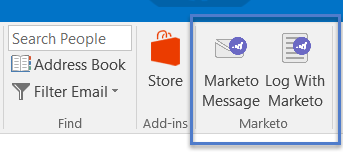

# Aggiorna il componente aggiuntivo e-mail di Marketo per Outlook {#upgrade-your-marketo-email-add-in-for-outlook}

Quando è disponibile una nuova versione del componente aggiuntivo e-mail di Marketo per Outlook, seguite le istruzioni riportate di seguito per effettuare l&#39;aggiornamento.

## Download del programma di installazione {#download-installer}

Scaricate il programma di installazione appropriato per la versione in uso di Microsoft Outlook.

<table> 
 <colgroup> 
  <col> 
  <col> 
  <col> 
  <col> 
  <col> 
 </colgroup> 
 <tbody> 
  <tr> 
   <th> </th> 
   <th colspan="2">Installazione di invito singolo utente</th> 
   <th colspan="2">Installazione della chiave Enterprise</th> 
  </tr> 
  <tr> 
   <td><strong>Versione di Outlook</strong></td> 
   <td><strong>32 bit</strong></td> 
   <td><strong>64 bit</strong></td> 
   <td><strong>32 bit</strong></td> 
   <td><strong>64 bit</strong></td> 
  </tr> 
  <tr> 
   <td>Outlook 2000</td> 
   <td>Non supportato</td> 
   <td>N/D</td> 
   <td>Non supportato</td> 
   <td>N/D</td> 
  </tr> 
  <tr> 
   <td>Outlook 2003</td> 
   <td><a href="https://munchkin.marketo.net/MarketoAddInSetup32.msi" rel="nofollow">Download</a></td> 
   <td>N/D</td> 
   <td>Non supportato</td> 
   <td>N/D</td> 
  </tr> 
  <tr> 
   <td>Outlook 2007</td> 
   <td><a href="https://munchkin.marketo.net/MarketoAddInSetup32.msi" rel="nofollow">Download</a></td> 
   <td>N/D</td> 
   <td>Non supportato</td> 
   <td>N/D</td> 
  </tr> 
  <tr> 
   <td>Outlook 2010</td> 
   <td><a href="https://munchkin.marketo.net/MarketoAddInSetup32.msi" rel="nofollow">Download</a></td> 
   <td><a href="https://munchkin.marketo.net/MarketoAddInSetup64.msi" rel="nofollow">Download</a></td> 
   <td><a href="https://munchkin.marketo.net/MarketoAddInSetup32.msi" rel="nofollow">Download</a></td> 
   <td><a href="https://munchkin.marketo.net/MarketoAddInSetup64.msi" rel="nofollow">Download</a></td> 
  </tr> 
  <tr> 
   <td>Outlook 2013</td> 
   <td><a href="https://munchkin.marketo.net/MarketoAddInSetup32.msi" rel="nofollow">Download</a></td> 
   <td><a href="https://munchkin.marketo.net/MarketoAddInSetup64.msi" rel="nofollow">Download</a></td> 
   <td><a href="https://munchkin.marketo.net/MarketoAddInSetup32.msi" rel="nofollow">Download</a></td> 
   <td><a href="https://munchkin.marketo.net/MarketoAddInSetup64.msi" rel="nofollow">Download</a></td> 
  </tr> 
  <tr> 
   <td>Outlook 2016</td> 
   <td><a href="https://munchkin.marketo.net/MarketoAddInSetup32.msi" rel="nofollow">Download</a></td> 
   <td><a href="https://munchkin.marketo.net/MarketoAddInSetup64.msi" rel="nofollow">Download</a></td> 
   <td><a href="https://munchkin.marketo.net/MarketoAddInSetup32.msi" rel="nofollow">Download</a></td> 
   <td><a href="https://munchkin.marketo.net/MarketoAddInSetup64.msi" rel="nofollow">Download</a></td> 
  </tr> 
  <tr> 
   <td colspan="1">Outlook 2019</td> 
   <td colspan="1"><a href="https://munchkin.marketo.net/MarketoAddInSetup32.msi" rel="nofollow">Download</a></td> 
   <td colspan="1"><a href="https://munchkin.marketo.net/MarketoAddInSetup64.msi" rel="nofollow">Download</a></td> 
   <td colspan="1"><a href="https://munchkin.marketo.net/MarketoAddInSetup32.msi" rel="nofollow">Download</a></td> 
   <td colspan="1"><a href="https://munchkin.marketo.net/MarketoAddInSetup64.msi" rel="nofollow">Download</a></td> 
  </tr> 
  <tr> 
   <td colspan="1">Outlook O365 (solo Windows)</td> 
   <td colspan="1"><a href="https://munchkin.marketo.net/MarketoAddInSetup32.msi" rel="nofollow">Download</a></td> 
   <td colspan="1"><a href="https://munchkin.marketo.net/MarketoAddInSetup64.msi" rel="nofollow">Download</a></td> 
   <td colspan="1"><a href="https://munchkin.marketo.net/MarketoAddInSetup32.msi" rel="nofollow">Download</a></td> 
   <td colspan="1"><a href="https://munchkin.marketo.net/MarketoAddInSetup64.msi" rel="nofollow">Download</a></td> 
  </tr> 
  <tr> 
   <td>Outlook per Mac</td> 
   <td>Non supportato</td> 
   <td>Non supportato</td> 
   <td>Non supportato</td> 
   <td>Non supportato</td> 
  </tr> 
  <tr> 
   <td colspan="1">Outlook Web App</td> 
   <td colspan="1">Non supportato</td> 
   <td colspan="1">Non supportato</td> 
   <td colspan="1">Non supportato</td> 
   <td colspan="1">Non supportato</td> 
  </tr> 
 </tbody> 
</table>

## Aggiornamento {#upgrade}

1. Eseguite il programma di installazione.

   

   Fate clic su Avanti.
   

   >[!NOTE]
   >
   >In alcuni casi i dati non saranno disponibili. Copiatelo dal messaggio e-mail di registrazione, quindi chiudete Outlook.

1. Chiudere Microsoft Outlook.

   

1. Noterete che tutte le vostre informazioni sono precompilate. È sufficiente fare clic su **Next**.

   

   >[!TIP]
   >
   >Se l&#39;installazione non riesce, collabora con il reparto IT per garantire che il traffico HTTPS non sia bloccato. Il programma di installazione richiede l&#39;apertura del traffico HTTPS.

   Fate clic su Avanti per eseguire l&#39;installazione nel percorso predefinito.

   

1. Fare clic su **Next**.

   

1. Installazione completata. Fare clic su **Chiudi**.

   

1. Ora aprire Microsoft Outlook per visualizzare la versione più recente dei pulsanti Marketo.

   

>[!MORELIKETHIS]
>
>* [Inviare e tenere traccia di un&#39;e-mail con il componente aggiuntivo e-mail Marketo per Outlook](send-and-track-an-email-with-the-email-add-in-for-outlook.md)
>* [Invio e tracciamento da Outlook con un modello Marketo](send-and-track-from-outlook-using-a-marketo-template.md)

>

