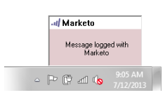

# Registra i messaggi in entrata dai lead in Marketo {#log-inbound-mail-from-your-leads-in-marketo}

È possibile registrare le risposte dai lead direttamente in Outlook con il componente aggiuntivo e-mail di Marketo.

## Dall&#39;applicazione principale di Outlook {#from-the-main-outlook-application}

1. Seleziona l’e-mail da registrare e fai clic su Registra con Marketo.

>[!TIP]
>
>Puoi anche fare clic con il pulsante destro del mouse su un messaggio e scegliere **Accedi a Marketo**.

Dovresti vedere una conferma.

## Dall’e-mail stessa {#from-the-email-itself}

Se hai aperto l’e-mail, puoi semplicemente fare clic sul pulsante Log with Marketo da lì.

Dovresti trovare la stessa conferma dell’altro metodo.

Registra le risposte del lead per aggiungerle alla cronologia in Marketo.

>[!MORELIKETHIS]
>
>* [Inviare e tenere traccia di un messaggio e-mail con il componente aggiuntivo e-mail di Marketo per Outlook](/help/marketo/product-docs/marketo-sales-insight/msi-outlook-plugin/send-and-track-an-email-with-the-email-add-in-for-outlook.md)
>* [Inviare e tenere traccia di Outlook utilizzando un modello di Marketo](/help/marketo/product-docs/marketo-sales-insight/msi-outlook-plugin/send-and-track-from-outlook-using-a-marketo-template.md)
