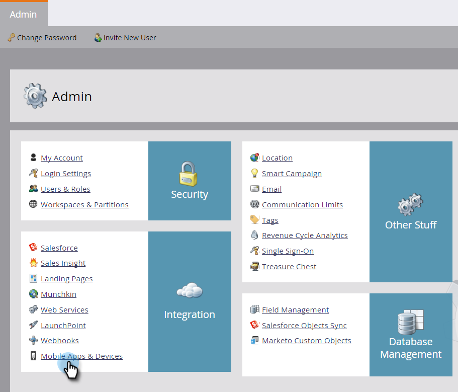

# Aggiungere un’app mobile {#add-a-mobile-app}

Invia notifiche push alla base clienti connettendo la tua app mobile a Marketo.

Le app solitamente iniziano in un ambiente sandbox, in cui vengono eseguiti lo sviluppo iniziale e il test. Gli sviluppatori utilizzano quindi un ambiente di produzione per creare l’app finale che verrà utilizzata dai clienti. Seleziona il certificato di notifica appropriato al momento dell’aggiunta di un’app mobile (vedi il passaggio 4 di seguito).

>[!AVAILABILITY]
>
>
>Questa funzionalità non è stata acquistata da tutti i clienti. Per ulteriori informazioni, contatta il tuo rappresentante commerciale.

1. Clic **Amministratore**.

   

1. Clic **App e dispositivi mobili**.

   

1. Clic **Nuova app mobile**.

   

1. Immetti un nome. In **Tipo** , selezionare il tipo di ambiente in uso: Sandbox o Produzione. Clic **Salva**.

   

   >[!NOTE]
   >
   >È consigliabile utilizzare un certificato di notifica di produzione in un ambiente di produzione. Un certificato Sandbox verrà installato in un ambiente di produzione senza problemi, ma non riceverai notifiche. In caso di domande sull’ambiente o sul certificato di notifica, contatta l’amministratore di Marketo o lo sviluppatore di app mobili.

   Bello! Ora configuriamo la tua app in modo che funzioni con dispositivi Android e iOS.

>[!MORELIKETHIS]
>
>* [Configurare l’accesso push Android per app mobili](/help/marketo/product-docs/mobile-marketing/admin/configure-mobile-app-android-push-access.md)
>* [Configurare l’accesso push di iOS per app mobili](/help/marketo/product-docs/mobile-marketing/admin/configure-mobile-app-ios-push-access.md)
