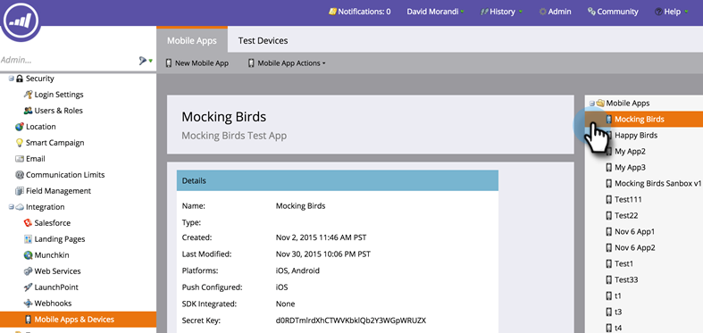

# Autenticazione della sicurezza di accesso mobile {#authenticate-mobile-access-security}

Per migliorare la sicurezza degli utenti di Mobile, Marketo fornisce due nuovi ID: la chiave di accesso e il segreto di accesso. Queste consentono di garantire che gli utenti che accedono all’app siano effettivamente gli utenti che si trovano nell’app.

Per abilitare gli ID, devi acquisire i codici e fornirli al reparto IT in modo che possano impostare una corrispondenza sicura.

>[!PREREQUISITES]
>
>Per abilitare questa funzione, contatta il Supporto e richiedi la &quot;Modalità protetta Vespa&quot;.

1. In Marketo, seleziona **Amministratore** e fai clic su **App e dispositivi mobili**.

   

1. Seleziona l’app mobile per la quale desideri abilitare l’accesso sicuro.

   

1. Scorri verso il basso e nella sezione Sicurezza accesso fai clic su **Modifica**.

   

1. Controlla la **Abilita protezione** casella di controllo. Fai clic su **Salva**.

   

1. Nell&#39;area Protezione accesso vengono ora visualizzati i due nuovi codici. Assicurati di inviarli al tuo reparto IT.

   
