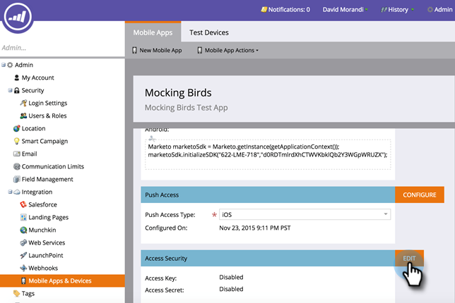
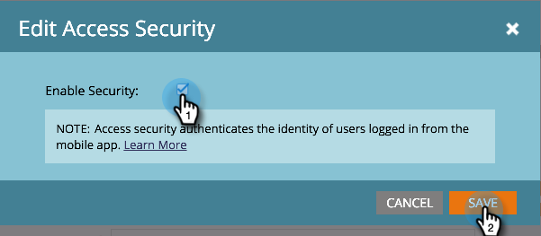

# Autenticare sicurezza accesso mobile {#authenticate-mobile-access-security}

Per migliorare la sicurezza per gli utenti di dispositivi mobili, Marketo fornisce due nuovi ID: [!UICONTROL Access Key] e [!UICONTROL Access Secret]. In questo modo gli utenti che accedono all’app saranno davvero gli stessi che sembrano essere.

Per abilitare gli ID, devi acquisire i codici e fornirli al reparto IT in modo che possano impostare una corrispondenza sicura.

>[!PREREQUISITES]
>
>Per abilitare questa funzione, contatta il supporto e richiedi &quot;Vespa Secure Mode&quot;.

1. In Marketo, selezionare **[!UICONTROL Admin]** e fare clic su **[!UICONTROL Mobile Apps & Devices]**.

   

1. Seleziona l’app mobile per la quale desideri abilitare l’accesso sicuro.

   

1. Scorri verso il basso e nella sezione [!UICONTROL Access Security] fai clic su **[!UICONTROL Edit]**.

   

1. Selezionare la casella di controllo **[!UICONTROL Enable Security]**. Fai clic su **[!UICONTROL Save]**.

   

1. Nell&#39;area [!UICONTROL Access Security] vengono ora visualizzati i due nuovi codici. Assicurati di inviarli al tuo reparto IT.

   
