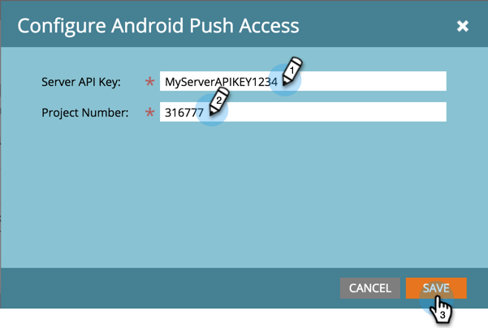

# Configurare l&#39;accesso push Android dell&#39;app mobile {#configure-mobile-app-android-push-access}

1. Fare clic su **Admin**.

   

1. Selezionare **App mobili**.

   

1. Seleziona l&#39;app mobile desiderata.

   

1. In **Tipo di accesso push**, selezionare **Android** e fare clic su **Configura.**

   

   >[!NOTE]
   >
   >Sarà necessario **Server API Key** e **Project Number** dallo sviluppatore delle app mobili. Lo sviluppatore riceve questi dati effettuando l&#39;accesso a Google Play Developer Console per registrare l&#39;app e abilitare i messaggi cloud.

1. Immettete la chiave API del server e il numero di progetto. Fare clic su **Salva**.

   

   Dolce. Accertatevi di configurare l&#39;app con iOS.

>[!MORELIKETHIS]
>
>[Configurare l&#39;accesso push iOS dell&#39;app mobile](/help/marketo/product-docs/mobile-marketing/admin/configure-mobile-app-ios-push-access.md)
