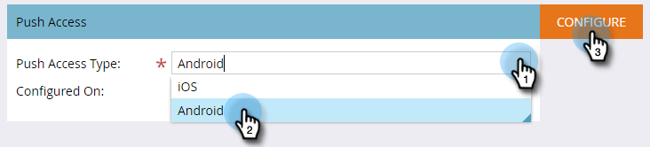

# Configurare l’accesso push di Android per app mobili {#configure-mobile-app-android-push-access}

1. Fai clic su **[!UICONTROL Admin]**.

   

1. Seleziona **[!UICONTROL Mobile Apps]**.

   

1. Seleziona l’app mobile desiderata.

   

1. In **[!UICONTROL Push Access Type]**, seleziona **[!UICONTROL Android]** e fai clic su **[!UICONTROL Configure]**.

   

   >[!NOTE]
   >
   >Avrai bisogno di **[!UICONTROL Server API Key]** e **[!UICONTROL Project Number]** dallo sviluppatore di app mobili. Lo sviluppatore riceve questi messaggi accedendo a [!DNL Google Play Developer Console] per registrare l&#39;app e abilitare i messaggi cloud.

1. Immettere [!UICONTROL Server API Key] e [!UICONTROL Project Number]. Fai clic su **[!UICONTROL Save]**.

   

   Dolce. Assicurarsi di configurare l&#39;app con [!UICONTROL iOS].

>[!MORELIKETHIS]
>
>[Configura l&#39;accesso push iOS per app mobili](/help/marketo/product-docs/mobile-marketing/admin/configure-mobile-app-ios-push-access.md)
