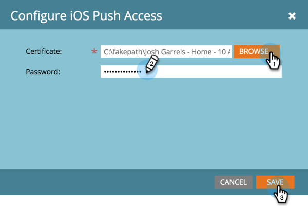

# Configurare l’accesso push di iOS per app mobili {#configure-mobile-app-ios-push-access}

1. Fai clic su **[!UICONTROL Admin]**.

   

1. Seleziona **[!UICONTROL Mobile Apps]**.

   

1. Seleziona l’app mobile desiderata.

   

1. In [!UICONTROL Push Access Type], selezionare iOS e fare clic su **[!UICONTROL Configure]**.

   

   >[!NOTE]
   >
   >Avrai bisogno di **[!UICONTROL Certificate]** e **[!UICONTROL Password]** dallo sviluppatore di app mobili. Lo sviluppatore riceve queste notifiche accedendo ad Apple Developer Member Center, configurando e scaricando un certificato di notifica push per l’app ed esportando il contenuto. Lo sviluppatore imposta la password durante l’esportazione. **IMPORTANTE**: il certificato deve essere appropriato per il tipo di ambiente in uso: Sandbox o Produzione. Verifica questa situazione con il tuo amministratore di Marketo o con lo sviluppatore di app per dispositivi mobili.

1. Seleziona [!UICONTROL Certificate], immetti [!UICONTROL Password] e fai clic su **[!UICONTROL Save]**.

   

Ottimo lavoro! Assicurati anche di configurare l’app con Android.

>[!MORELIKETHIS]
>
>[Configura l&#39;accesso push Android per app mobili](/help/marketo/product-docs/mobile-marketing/admin/configure-mobile-app-android-push-access.md)
