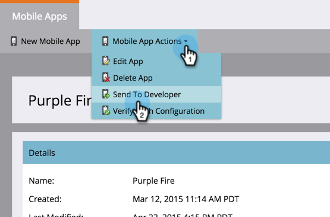

# Inviare codice SDK a uno sviluppatore {#send-sdk-code-to-a-developer}

Prima di poter creare messaggi in-app o notifiche push, è necessario che lo sviluppatore configuri e inizializzi l’SDK dell’app mobile per le piattaforme Android e iOS.

* [Istruzioni per Android](https://developers.marketo.com/documentation/mobile/installation-instructions-on-android/)
* [Istruzioni per iOS](https://developers.marketo.com/documentation/mobile/installation-instructions-on-ios/)

## Inviare codice SDK a uno sviluppatore {#send-sdk-code-to-a-developer-1}

A volte, un amministratore deve inviare del codice SDK a uno sviluppatore.

Ecco come si fa.

1. Clic **Amministratore**.

   

1. Seleziona **App mobili**.

   

1. Seleziona l’app mobile desiderata.

   

1. Clic **Azioni app mobile** e seleziona **Invia a sviluppatore**.

   

1. Inserisci un indirizzo e-mail e fai clic su **Invia**.

   

   Il codice SDK verrà ora inviato al tuo sviluppatore.
