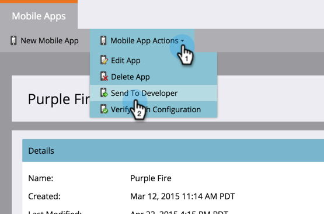

# Inviare codice SDK a uno sviluppatore {#send-sdk-code-to-a-developer}

Prima di poter creare messaggi in-app o notifiche push, è necessario che lo sviluppatore configuri e inizializzi l’app mobile SDK per le piattaforme Android e iOS.

* [Istruzioni per Android](https://experienceleague.adobe.com/it/docs/marketo-developer/marketo/mobile/installation#how-to-install-marketo-sdk-on-android)
* [Istruzioni per iOS](https://experienceleague.adobe.com/it/docs/marketo-developer/marketo/mobile/installation#how-to-install-marketo-sdk-on-ios)

## Inviare codice SDK a uno sviluppatore {#send-sdk-code-to-a-developer-1}

A volte, un amministratore deve inviare del codice SDK a uno sviluppatore.

Ecco come si fa.

1. Fai clic su **[!UICONTROL Admin]**.

   

1. Seleziona **[!UICONTROL Mobile Apps]**.

   

1. Seleziona l’app mobile desiderata.

   

1. Fare clic su **[!UICONTROL Mobile App Actions]** e selezionare **[!UICONTROL Send to Developer]**.

   

1. Immettere un indirizzo di posta elettronica e fare clic su **[!UICONTROL Send]**.

   

   Il codice SDK verrà ora inviato al tuo sviluppatore.
