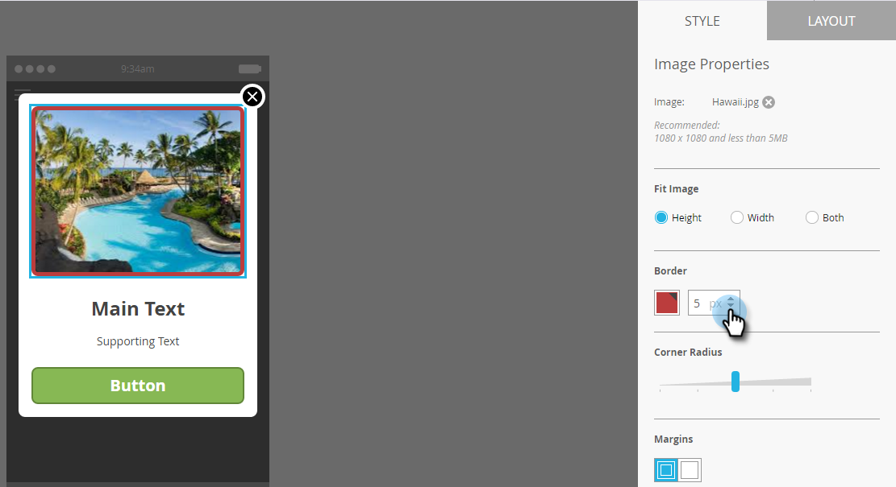

# Aggiungi immagini messaggi in-app {#add-in-app-message-images}

Qui puoi scegliere e personalizzare le immagini dei messaggi in-app.

1. Seleziona il messaggio in-app e fai clic su **Modifica bozza**.

   

1. Scegliere uno dei sei modelli disponibili nella scheda Layout. Sono disponibili tre opzioni per la visualizzazione a comparsa e tre per la visualizzazione a schermo intero.

   >[!TIP]
   >
   >Qual è la differenza tra i modelli? Consulta [Scegli un layout per il messaggio in-app](/help/marketo/product-docs/mobile-marketing/in-app-messages/creating-in-app-messages/choose-a-layout-for-your-in-app-message.md) prima di iniziare.

   

1. Fai clic su **Stile** e fare clic sull&#39;area immagine del modello.

   

1. Clic **Seleziona immagine**.

   

1. Selezionare l&#39;immagine da Design Studio e fare clic su **Seleziona**.

   

   >[!NOTE]
   >
   >Le dimensioni dell&#39;immagine sono limitate a 1440 x 2560 px e 5 MB.

1. Cambiare idea e vuoi usare un&#39;immagine diversa? Nessun problema. Fai clic su **X** accanto al nome del file immagine.

   

1. Clic **Rimuovi**. Ora puoi sceglierne un altro.

   

1. Con l’immagine desiderata nella sezione Proprietà immagine, seleziona un pulsante per adattarla a altezza, larghezza o entrambe.

   

1. Se necessario, applicare un bordo immagine. L&#39;impostazione predefinita è **Disattivato**. Innanzitutto, selezionare il colore facendo clic su di esso o immettendo i numeri esadecimali o RGB nel selettore colore.

   

1. Fare clic sulle frecce per modificare la larghezza del bordo, in pixel. Vedrai che cambia nell&#39;immagine.

   

1. Selezionate un raggio d&#39;angolo utilizzando il cursore. Selezionare una posizione da sinistra a destra: 0, 4, 8, 12 o 16 pixel. La selezione di 8 pixel (centro) è l&#39;impostazione predefinita.

   

1. Selezionare un margine (attivato o disattivato). **On** è l&#39;impostazione predefinita.

   

1. Seleziona la casella per definire un’azione di tocco dell’immagine.

   

1. Per ogni piattaforma è disponibile un&#39;azione separata (vedere la nota).

   

1. Fai clic su ciascun elenco a discesa per visualizzare le opzioni. Selezionane uno.

   

   >[!NOTE]
   >
   >Per le azioni di tocco relative a immagini, pulsanti o sfondi, puoi impostare azioni diverse per le piattaforme Apple e Android. Ad esempio, i collegamenti profondi vengono gestiti in modo diverso per Apple e Android. Se il messaggio riguarda solo una piattaforma o l’altra, lascia l’altra nell’impostazione predefinita o seleziona **Nessuno**.

Ottimo lavoro! Ora è il momento di [creare il testo per il messaggio in-app](/help/marketo/product-docs/mobile-marketing/in-app-messages/creating-in-app-messages/create-in-app-message-text.md).

>[!MORELIKETHIS]
>
>* [Informazioni sui messaggi in-app](/help/marketo/product-docs/mobile-marketing/in-app-messages/understanding-in-app-messages.md)
>* [Scegli un layout per il messaggio in-app](/help/marketo/product-docs/mobile-marketing/in-app-messages/creating-in-app-messages/choose-a-layout-for-your-in-app-message.md)
