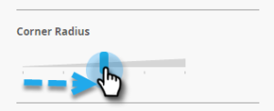

# Aggiungere immagini messaggio in-app {#add-in-app-message-images}

Qui puoi scegliere e personalizzare le immagini dei messaggi in-app.

1. Seleziona il messaggio in-app e fai clic su **Modifica bozza**.

   

1. Scegliere uno dei sei modelli nella scheda Layout. Sono disponibili tre opzioni Pop Up e tre opzioni Full Screen.

   >[!TIP]
   >
   >Qual è la differenza tra i modelli? Vedi [Scegliere un layout per il messaggio in-app](/help/marketo/product-docs/mobile-marketing/in-app-messages/creating-in-app-messages/choose-a-layout-for-your-in-app-message.md) prima di iniziare.

   

1. Fai clic sul pulsante **Stile** e fai clic sull’area immagine del modello.

   

1. Fai clic su **Seleziona immagine**.

   

1. Seleziona l&#39;immagine da Design Studio e fai clic su **Seleziona**.

   

   >[!NOTE]
   >
   >Le dimensioni dell&#39;immagine sono limitate a 1440 x 2560 px e 5 MB.

1. Cambia idea e vuoi usare un&#39;immagine diversa? Nessun problema. Fai clic sul pulsante **X** accanto al nome del file immagine.

   

1. Fai clic su **Rimuovi**. Ora, potete sceglierne un altro.

   

1. Con l’immagine desiderata in Proprietà immagine, seleziona un pulsante per adattarla all’immagine in base a Altezza, Larghezza o Entrambe.

   

1. Facoltativamente, applica un bordo immagine. L&#39;impostazione predefinita è **Disattivato**. Per prima cosa, selezionare il colore facendo clic su di esso o immettendo i numeri esadecimali o RGB sul selettore colore.

   

1. Fare clic sulle frecce per modificare la larghezza del bordo, in pixel. Lo vedrete cambiare sull&#39;immagine.

   

1. Selezionate un raggio d&#39;angolo utilizzando il cursore. Selezionare una posizione da sinistra a destra: 0, 4, 8, 12 o 16 pixel. La selezione predefinita è 8 pixel (al centro).

   

1. Selezionare un margine (attivato o disattivato). **On** è l&#39;impostazione predefinita.

   

1. Seleziona la casella per definire un’azione di tocco immagine.

   

1. È disponibile un’azione separata per ogni piattaforma (consulta Nota).

   

1. Fai clic su ogni menu a discesa per visualizzare le opzioni. Selezionane uno.

   

   >[!NOTE]
   >
   >Per le azioni di tocco per immagini, pulsanti o sfondi, puoi impostare diverse azioni per le piattaforme Apple e Android. Ad esempio, i collegamenti profondi vengono gestiti in modo diverso per Apple e Android. Se il messaggio viene inviato solo a una piattaforma o all’altra, puoi lasciare l’altra nell’impostazione predefinita oppure selezionare **Nessuno**.

Ottimo lavoro! Ora, è ora di [crea il testo per il messaggio in-app](/help/marketo/product-docs/mobile-marketing/in-app-messages/creating-in-app-messages/create-in-app-message-text.md).

>[!MORELIKETHIS]
>
>* [Informazioni sui messaggi in-app](/help/marketo/product-docs/mobile-marketing/in-app-messages/understanding-in-app-messages.md)
>* [Scegliere un layout per il messaggio in-app](/help/marketo/product-docs/mobile-marketing/in-app-messages/creating-in-app-messages/choose-a-layout-for-your-in-app-message.md)

