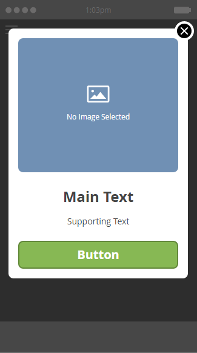
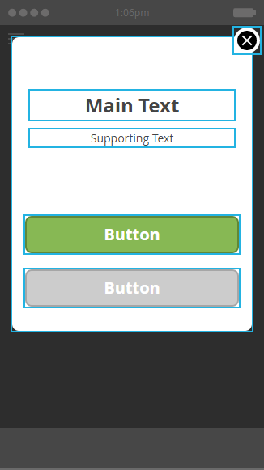

# Scegli un layout per il messaggio in-app {#choose-a-layout-for-your-in-app-message}

Marketo fornisce sei layout per la creazione di messaggi in-app.

* I layout a comparsa sono più tradizionali e ideali se non disponete di un team creativo per fornire contenuti e non avete bisogno di un aspetto specifico. Puoi creare e modificare facilmente i tuoi messaggi in-app, all&#39;interno di Marketo
* I layout a schermo intero vi consentono di importare i vostri progetti finiti, offrendovi la massima flessibilità grafica

## Layout popup {#pop-up-layouts}

I tre layout a comparsa offrono tutti elementi di progettazione predefiniti, tra cui un’immagine, testo, pulsanti e uno sfondo.

Il primo layout a comparsa è la selezione predefinita per un buon motivo: Si adatta alla maggior parte degli usi. Funziona perfettamente con le immagini a bassa risoluzione. Questo layout utilizza i font standard per la vostra piattaforma (Helvetica per Apple, Roboto per Android), quindi è sempre adatto su un telefono o un tablet. Potete caricare e inserire le immagini principali e di sfondo, scrivere il testo principale e di supporto, nonché configurare i pulsanti principale e di disattivazione. Il testo è limitato a tre righe a 24 pixel. Dimensioni maggiori del tipo riducono il numero di linee.

Il secondo layout a comparsa elimina le caselle di testo e lascia più spazio a un’immagine più alta. Aggiungete del testo, a scelta dello stile, all’immagine prima di importarla, per un aspetto personalizzato.

Il terzo layout a comparsa è ottimo se non è necessario utilizzare un&#39;immagine nel messaggio in-app. Due pulsanti consentono ai destinatari dei messaggi di scegliere tra diverse azioni. Il testo è limitato a tre righe. Dimensioni maggiori dei tipi ridurranno il numero di righe disponibili.

## Layout a schermo intero {#full-screen-layouts}

I tre layout di stile Schermo intero sono progettati per importare grafica completata. Selezionate i font e incorporateli nell’elemento grafico per farli corrispondere a qualsiasi pagina Web o promozione.

Il primo layout a schermo intero offre un quadro vuoto. Viene visualizzato esattamente ciò che caricate, senza dilatare o ritagliare l’immagine (vedere l’esempio di seguito). Si restringe per adattarsi, lasciando intorno ad esso aree vuote, a seconda della forma dell&#39;immagine. Nessuna parte dell’immagine viene rimossa.

L’immagine orizzontale viene visualizzata a larghezza intera, lasciando spazio vuoto sopra e sotto.

Il secondo layout Schermo intero aggiunge campi di testo e un pulsante.

A differenza del primo layout Schermo intero, questo, insieme al terzo layout Schermo intero (sotto), espande l&#39;immagine inserita per adattarsi all&#39;altezza completa e ritaglia i lati. A seconda dell’immagine originale, questo può creare un’immagine di sfondo accattivante. In questo esempio viene usata la stessa immagine di cui sopra,

Il terzo layout Schermo intero è lo stesso del secondo, tranne il secondo pulsante. Questo fornisce ulteriori opzioni per i destinatari dei messaggi.

Ora che conosci i modelli, è il momento di sceglierne uno quando [crei le immagini dei messaggi in-app](add-in-app-message-images.md).

>[!MORELIKETHIS]
>
>* [Creare un messaggio in-app](https://docs.marketo.com/display/docs/create+an+in-app+message)
>* [Informazioni sui messaggi in-app](../../../../product-docs/mobile-marketing/in-app-messages/understanding-in-app-messages.md)

>

