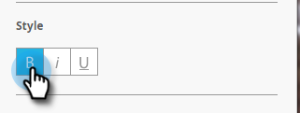

# Crea testo messaggio in-app {#create-in-app-message-text}

Fare clic sull&#39;area di testo per lavorare sullo stile e sul contenuto del testo.

1. Fai clic sul Testo principale per modificarlo in linea.

   

1. Scegliere il colore del testo facendo clic su di esso o immettendo i numeri di esadecimale o RGB nel selettore colore.

   

1. Fare clic sulle frecce per selezionare una dimensione di testo.

   

   >[!CAUTION]
   >
   >Una dimensione troppo grande del testo potrebbe spingere il contenuto oltre le tre righe di testo visibili massime.

1. Scegliere uno stile di tipo facoltativo per enfasi: **Bold**, _Corsivo_, o Sottolineato.

   

1. Scegliere l&#39;allineamento del testo: Sinistra, Centrata, Destra. Il valore predefinito è Centrato.

   

   >[!NOTE]
   >
   >Il font del testo renderizzato nell’annuncio è quello standard per ogni piattaforma: Helvetica per Apple e Roboto per Android

1. Seleziona la casella per selezionare Azione di tocco Testo.

   

1. Seleziona azione di tocco per ciascuna piattaforma: Apple o Android.

   

   >[!NOTE]
   >
   >Per le azioni di tocco, puoi impostare azioni diverse per le piattaforme Apple e Android. Ad esempio, i collegamenti profondi vengono gestiti in modo diverso per Apple e Android. Se il messaggio viene inviato solo a una piattaforma o all’altra, puoi lasciare l’altra nell’impostazione predefinita o selezionare Nessuna.

1. Fare clic sul testo di supporto per modificarlo in linea. Funziona allo stesso modo della modifica del testo principale, ma la dimensione predefinita del testo è inferiore.

   

1. Per il testo principale o di supporto, fai clic sull’icona Token per aggiungere un token.

   

1. Seleziona un Token personale dal menu a discesa, aggiungi un valore predefinito e fai clic su **Inserisci**.

   

   >[!NOTE]
   >
   >Solo I miei token sono disponibili come opzioni. Se nel programma non è stato impostato alcun token, l’elenco a discesa Token sarà vuoto.

   >[!TIP]
   >
   >Considera la lunghezza dei caratteri risolti da un token quando viene visualizzato dal pubblico. Lascia spazio sufficiente per tenere conto di valori potenzialmente più lunghi, per evitare che vengano tagliati.

   Eventuali modifiche apportate ai token utilizzati in un programma di messaggi in-app approvato non avranno effetto nel messaggio in-app fino a quando il programma non viene sospeso e quindi ripreso.

Tu sei dorata. Quindi, devi [configurare il pulsante del messaggio in-app](/help/marketo/product-docs/mobile-marketing/in-app-messages/creating-in-app-messages/set-up-the-in-app-message-button.md).

>[!MORELIKETHIS]
>
>* [Informazioni sui messaggi in-app](/help/marketo/product-docs/mobile-marketing/in-app-messages/understanding-in-app-messages.md)
>* [Scegli un layout per il messaggio in-app](/help/marketo/product-docs/mobile-marketing/in-app-messages/creating-in-app-messages/choose-a-layout-for-your-in-app-message.md)
