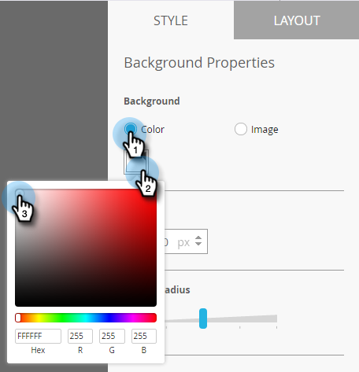

# Impostazione dello sfondo dei messaggi in-app {#set-up-the-in-app-message-background}

La selezione dello sfondo di un messaggio è un passo importante per completare il messaggio in-app.

>[!TIP]
>
>Per le immagini di sfondo, le texture e le sfumature funzionano meglio.

1. Nell’editor, fate clic sull’area di sfondo.

   

1. Per impostare un colore, fare clic su **Colore**, quindi sul quadrato di selezione del colore. Selezionate il colore facendo clic su di esso o immettendo i codici esadecimali o RGB nel selettore colore.

   

   >[!NOTE]
   >
   >Bianco semplice, il valore predefinito, è in genere un vincitore.

1. Se si desidera utilizzare uno sfondo, fare clic su **Immagine**, quindi sul collegamento **Seleziona immagine**.

   

1. Scegliete tra i file caricati in Design Studio. Fare clic su **Seleziona**.

   

   >[!NOTE]
   >
   >Le dimensioni delle immagini sono limitate a 1440 x 2560 px e 5 MB.

1. Valuta i risultati. Oops-forse un colore normale, texture o sfumatura funzionerà meglio!

   

1. Consente di applicare un bordo immagine facoltativo. L&#39;impostazione predefinita è **Off**. Innanzitutto, selezionate il colore facendo clic su di esso o immettendo i numeri esadecimali o RGB nel selettore colore.

   

1. Fare clic sulle frecce per variare la larghezza del bordo. Questo bordo verde di 12 pixel modifica l&#39;aspetto del messaggio in-app.

   

1. Selezionate il raggio di un angolo utilizzando il cursore. Selezionate una posizione da sinistra a destra: 0, 4, 8, 12 o 16 pixel. La selezione predefinita è 8 pixel (al centro).

   

1. Selezionare la casella per impostare l&#39;azione del tocco in background (disattivata per impostazione predefinita).

   

   >[!NOTE]
   >
   >Per le azioni di tocco per gli sfondi, potete impostare diverse azioni per le piattaforme Apple e Android. Ad esempio, i collegamenti profondi vengono gestiti in modo diverso per Apple e Android. Se il messaggio viene inviato solo a una piattaforma o all&#39;altra, lasciare l&#39;altra nell&#39;impostazione predefinita oppure selezionare **None**.

   [impostare il pulsante Ignora](set-up-the-dismiss-button-and-approve-the-message.md)

   >[!MORELIKETHIS]
   >
   >
   >    
   >    
   >    * [Informazioni sui messaggi in-app](../../../../product-docs/mobile-marketing/in-app-messages/understanding-in-app-messages.md)
   >    * [Invio di un messaggio in-app](https://docs.marketo.com/pages/viewpage.action?pageid=10617378)
   >    * [Scegliere un layout per il messaggio in-app](choose-a-layout-for-your-in-app-message.md)

Per completare il lavoro, l&#39;ultimo passaggio è quello di .