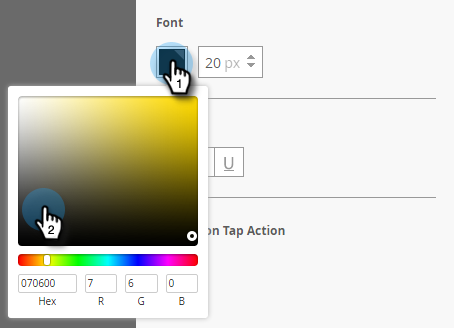
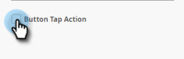

# Configurare il pulsante Messaggio in-app {#set-up-the-in-app-message-button}

Puoi utilizzare la progettazione predefinita del pulsante, modificarla o caricare un’immagine personalizzata del pulsante.

1. Fare clic sul pulsante per aprire la scheda Stile per la modifica.

   

1. Per modificare il colore del pulsante standard, fare clic sul pulsante **Colore** pulsante.

   

1. Fare clic sul quadrato di selezione del colore e selezionare il colore del pulsante facendo clic su di esso o immettendo i numeri esadecimali o RGB nel selettore del colore.

   

1. Selezionare una forma nel menu a discesa. Le scelte di forma standard includono angoli vivi, angoli arrotondati e sfumature.

   

1. Se si desidera utilizzare un&#39;immagine personalizzata per un pulsante, fare clic sul pulsante Immagine e quindi su **Seleziona immagine**.

   

1. Scegli l’immagine e fai clic su **Seleziona**.

   

   >[!TIP]
   >
   >Quando inserisci un’immagine personalizzata per il pulsante, considera di cancellare il testo segnaposto posizionato sopra di esso se l’immagine include già del testo.

1. Fare clic sul quadrato di selezione del colore e quindi selezionare il colore del carattere facendo clic su di esso o immettendo i numeri esadecimali o RGB nel selettore del colore.

   

1. Fare clic sulle frecce per scegliere la dimensione del carattere.

   

1. Scegliere lo stile del carattere per l&#39;enfasi: **Bold**, _Corsivo_, o Sottolineato.

   

1. Fai clic sul testo del pulsante per modificarlo in linea.

   

1. Seleziona la casella per impostare l’azione di tocco del pulsante.

   

1. Fai clic sul menu a discesa per ciascuna piattaforma e seleziona un’azione di tocco.

   

   >[!NOTE]
   >
   >Il pulsante ha sempre un&#39;azione di tocco, pertanto la casella di controllo Azione tocco viene selezionata automaticamente con il messaggio predefinito &quot;Ignora messaggio&quot;.

Ci siamo quasi. L’ultimo passaggio consiste nel [configurare lo sfondo del messaggio in-app e il pulsante chiudi](/help/marketo/product-docs/mobile-marketing/in-app-messages/creating-in-app-messages/set-up-the-in-app-message-background.md).

>[!MORELIKETHIS]
>
>* [Informazioni sui messaggi in-app](/help/marketo/product-docs/mobile-marketing/in-app-messages/understanding-in-app-messages.md)
>* [Scegli un layout per il messaggio in-app](/help/marketo/product-docs/mobile-marketing/in-app-messages/creating-in-app-messages/choose-a-layout-for-your-in-app-message.md)
