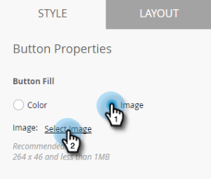

# Impostazione del pulsante Messaggio in-app {#set-up-the-in-app-message-button}

Potete utilizzare la struttura del pulsante predefinita, modificarla o caricare la vostra immagine personalizzata.

1. Fare clic sul pulsante per aprire la scheda Stile per la modifica.

   

1. Per modificare il colore del pulsante standard, fare clic sul pulsante **Colore**.

   

1. Fate clic sul quadrato di selezione del colore e selezionate il colore del pulsante facendo clic su di esso o immettendo i numeri esadecimali o RGB nel selettore colore.

   

1. Seleziona una forma nel menu a discesa. Le scelte di forma standard includono angoli appuntiti, angoli arrotondati e sfumature.

   

1. Se desiderate utilizzare la vostra immagine per un pulsante, fate clic sul pulsante Immagine e fate clic su **Seleziona immagine**.

   

1. Scegliete l&#39;immagine e fate clic su **Seleziona**.

   

   >[!TIP]
   >
   >Quando inserite un&#39;immagine personalizzata per il pulsante, considerate la possibilità di cancellare il testo segnaposto disposto sopra di esso se l&#39;immagine include già del testo.

1. Fate clic sul quadrato di selezione del colore, quindi selezionate il colore del font facendo clic su di esso o immettendo numeri esadecimali o RGB nel selettore colore.

   

1. Fate clic sulle frecce per scegliere la dimensione del font.

   

1. Scegliete lo stile del font da evidenziare: **Grassetto**, *Corsivo* o Sottolineato.

   

1. Fate clic sul testo del pulsante per modificarlo in linea.

   

1. Selezionare la casella per impostare l&#39;azione del tocco del pulsante.

   

   Fai clic sul menu a discesa per ciascuna piattaforma e seleziona un&#39;azione di tocco.

   

   >[!NOTE]
   >
   >**Promemoria**
   >
   >
   >Il pulsante ha sempre un&#39;azione di tocco, quindi la casella di controllo Tocca azione è automaticamente selezionata, con il messaggio predefinito &quot;Disattiva messaggio&quot;.

   [configura lo sfondo del messaggio in-app e il pulsante di disattivazione](set-up-the-in-app-message-background.md)

Quasi lì. L&#39;ultimo passo è quello di .

>[!MORELIKETHIS]
>
>* [Informazioni sui messaggi in-app](../../../../product-docs/mobile-marketing/in-app-messages/understanding-in-app-messages.md)
>* [Scegliere un layout per il messaggio in-app](choose-a-layout-for-your-in-app-message.md)

>

