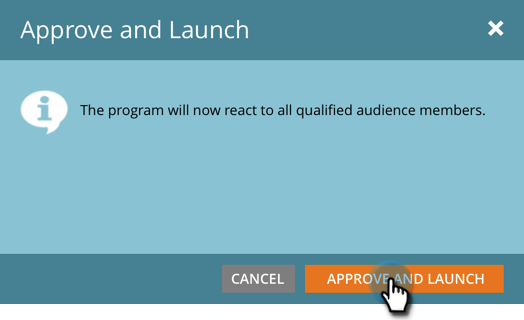

# Approvare il messaggio in-app {#approve-your-in-app-message}

È necessario approvare l’invio prima che il messaggio in-app venga inviato.

1. Se tutto funziona correttamente, fare clic su **Approva e avvia**.

   

   >[!NOTE]
   >
   >Se una parte del processo di invio è incompleta, ad esempio il messaggio in-app non viene approvato, viene visualizzato un messaggio di avviso che indica quale area richiede la tua attenzione. Risolvere il problema: dovrebbe comparire il messaggio nel passaggio 2.

1. Clic **Approva e avvia**.

   

1. Se hai utilizzato campi personalizzati, l’esecuzione di Marketo potrebbe richiedere più tempo e al suo posto verrà visualizzato questo messaggio.

   

1. Il messaggio è ora attivo.

   

   >[!NOTE]
   >
   >In genere sono necessari dai 15 ai 30 minuti affinché un messaggio in-app approvato sia visibile ai visitatori nel programma. Se utilizzi campi personalizzati, potrebbero essere necessarie diverse ore o più.

   È possibile mettere in pausa o interrompere un programma attivo, ma c&#39;è una grande differenza tra queste due opzioni.

1. Clic **Pausa programma** se è necessario interrompere il programma per un certo periodo di tempo ma riprenderlo in un secondo momento. Cambierà in **In pausa** stato.

   

   >[!NOTE]
   >
   >La sospensione può essere utile solo per interromperla per un po’ oppure se desideri modificare il messaggio o modificare la pianificazione. Tuttavia, non puoi passare a un messaggio diverso, ma solo modificare quello esistente.

1. Se si desidera che il programma in pausa continui a essere in esecuzione, fare clic su **Riprendi programma**.

   

1. Per interrompere completamente il programma, fare clic su **Interrompi programma**.

   

1. Se si desidera interrompere il programma, fare clic su **Interrompi**.

   

   >[!NOTE]
   >
   >Quando si interrompe un programma, questo non viene più eseguito e non può essere ripreso. Se desideri eseguirlo di nuovo, dovrai ricrearlo. Quindi, assicurati di aver completato un programma prima di fare clic su **Interrompi programma**!

## Dashboard in-app {#in-app-dashboard}

Dopo l’esecuzione del programma, puoi monitorarne le prestazioni con la dashboard in-app, che viene visualizzata automaticamente dopo l’approvazione del programma. Per tornare al programma, fai clic sul collegamento in alto a destra e seleziona **Pannello di controllo Campaign**.

Tutto qui, gente!
