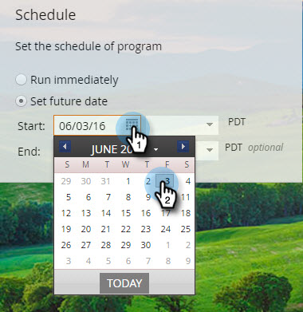

# Pianificare il messaggio in-app {#schedule-your-in-app-message}

Invia subito il messaggio o pianificalo per dopo.

1. Per pianificare un messaggio in-app, seleziona **[!UICONTROL Set future date]** e scegli una data di inizio dal calendario a discesa.

   

1. Seleziona un’ora di inizio dal menu a discesa.

   

1. La data e l’ora di fine sono facoltative; selezionale dai menu a discesa.

   

1. In alternativa, per eseguire il programma in questo momento, selezionare **[!UICONTROL Run Immediately]**. I campi Data inizio scompaiono.

   

Facile! Ultimo, ma non meno importante, è il passaggio [Approvazione](/help/marketo/product-docs/mobile-marketing/in-app-messages/sending-your-in-app-message/approve-your-in-app-message.md).
