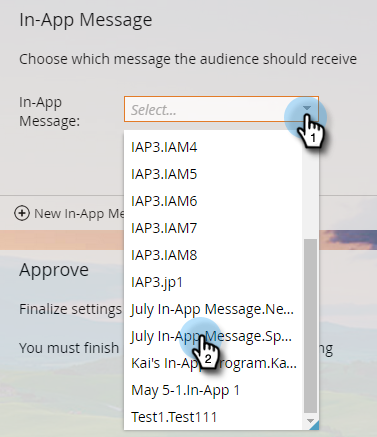

# Seleziona il messaggio in-app {#select-your-in-app-message}

Qui puoi selezionare il messaggio creato da utilizzare nel programma.

1. Seleziona il messaggio in-app dal menu a discesa .

   

   >[!NOTE]
   >
   >Tutti i messaggi sono disponibili per la selezione, indipendentemente da dove risiedono. Marketo aggiunge il nome padre a ciascuno di essi, per essere sicuri che ogni file riceva un nome univoco.

1. Dopo aver selezionato il messaggio, è pronto. È possibile modificarlo o visualizzarlo in anteprima.

   

   >[!TIP]
   >
   >Per selezionare un messaggio diverso, eliminalo nel campo Messaggio in-app . Quindi torna il nuovo collegamento Messaggio in-app . Fai clic su di esso e seleziona un messaggio diverso.

Siete sulla buona strada. Tempo di [programmare l&#39;invio](/help/marketo/product-docs/mobile-marketing/in-app-messages/sending-your-in-app-message/schedule-your-in-app-message.md).
