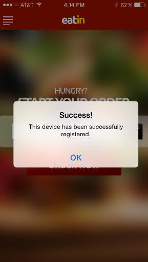

# Aggiunta di un nuovo dispositivo di prova {#adding-a-new-test-device}

È facile aggiungere un nuovo dispositivo di prova a cui inviare le notifiche push.

>[!NOTE]
>
>**Autorizzazioni amministratore richieste**

1. Fare clic su **Admin**, quindi sul collegamento **Mobile Apps**.

   

1. Fare clic sulla scheda **Dispositivi di prova** e **Nuovo dispositivo di prova**.

   

1. Selezionate l&#39;app.

   

1. Sono disponibili due modi per collegare il dispositivo all&#39;app.

   Con la prima opzione, è sufficiente copiare l’URL dal campo e inviarlo in un messaggio e-mail o in un messaggio di testo al dispositivo. Dal dispositivo, toccate l’URL.

   

   Oppure, con la seconda opzione, fate clic sul secondo pulsante e digitalizzate il Codice QR con il dispositivo.

   

1. Viene aperta l&#39;app. Assegnare un nome al dispositivo e toccare **Sì**.

   

   Successo!

   

1. Viene aggiunto l’aggiornamento dello stato per mostrare il dispositivo. Congratulazioni!

   
