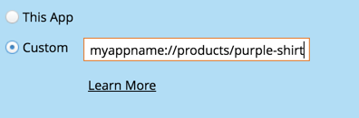

# Configurare le notifiche push mobili {#configure-mobile-push-notification}

1. Andate all&#39;area **Attività di marketing**.

1. Selezionate la risorsa push e fate clic su **Modifica bozza**.

   

1. Vai a **Setup**.

   

1. Selezionate l&#39;app desiderata. Le piattaforme Android e Apple sono abilitate per impostazione predefinita.

   

1. Se il messaggio push viene applicato a una sola piattaforma (ad esempio, casi per iPhone), potete escludere l&#39;altra piattaforma spostando il selettore su Disattivato.

   

1. Fare clic su **Next**.

   

1. Inserite il testo del messaggio o selezionate l&#39;icona del token per aggiungere i token. Quindi, selezionare un **Toccate Action**.

   

   >[!NOTE]
   >
   >Se una piattaforma è attivata, viene visualizzata sul lato sinistro dello schermo del telefono. Viene visualizzata a colori quando è selezionata.

   >[!NOTE]
   >
   >Esistono tre tipi di azioni di tocco:
   >
   >**Avvia app**  -  **Viene** visualizzata la pagina principale dell&#39;app quando viene toccata la notifica. **** Personalizza un collegamento diretto per aprire altre aree dell&#39;app o qualsiasi altra app a cui hai collegamento (consulta  [URI collegamento profondo ](#Deeplink) di seguito).
   >
   >**Pagina**  di destinazione: consente di passare a una specifica pagina di destinazione Marketo.
   >
   >**URL**  esterno: consente di passare a una pagina di destinazione non Marketo.

1. Per inserire un collegamento profondo per un&#39;azione di tocco personalizzata, fai clic su Personalizzato e immetti nel campo l&#39; [URI del collegamento profondo](#Deeplink).

   

1. Per inserire i token, selezionare un token, immettere un valore predefinito e fare clic su Inserisci.

   >[!NOTE]
   >
   >I token vengono visualizzati nel punto in cui si posiziona il cursore nella casella di testo. Potete utilizzare più token.

   

   >[!NOTE]
   >
   >Messaggi e azioni di tocco avranno lo stesso aspetto su entrambe le piattaforme.

1. Solo per iOS, seleziona la casella di controllo per indicare all&#39;app di riprodurre un suono all&#39;arrivo del messaggio. Android riproduce il suono automaticamente.

   

1. Visualizzare l&#39;anteprima dell&#39;altra piattaforma e fare clic su **Fine**.

   

1. Fare clic su **Approva e Chiudi**.

   

Congratulazioni! Ora la notifica push è pronta per essere inviata.

## URI collegamento profondo {#deep-link-uris}

Quando gli utenti iscritti fanno clic su un pulsante in un messaggio push, possono passare alla home page dell&#39;app o direttamente a una pagina specifica all&#39;interno dell&#39;app. Un collegamento profondo è un riferimento univoco a una pagina specifica nell&#39;app e ha l&#39;aspetto di un collegamento a un sito Web.

Un URI di collegamento profondo è composto da tre parti: nome, percorso e identificatore dello schema. Nell&#39;esempio seguente, &quot;myappname&quot; è lo schema. &quot;products&quot; è il percorso e &quot;purple-shirt&quot; è l’identificatore. Quando il cliente tocca, vengono indirizzati in modo specifico all’elemento camicia viola all’interno delle pagine del prodotto dell’app.

Detto questo, la struttura di collegamento profondo dell&#39;app potrebbe essere diversa dall&#39;esempio precedente. Lo sviluppatore dispone di numerose opzioni per definire gli URI dei collegamenti profondi, pertanto chiedi allo sviluppatore di inviarti gli URI (collegamenti) per le pagine che ti interessano. In questo modo gli URI immessi nei messaggi push verranno indirizzati nei punti giusti. Lo sviluppatore può [trovare ulteriori informazioni qui](https://developers.marketo.com/mobile/enabling-deep-links-in-your-app/).

>[!MORELIKETHIS]
>
>[Invia una notifica push mobile](/help/marketo/product-docs/mobile-marketing/push-notifications/send-a-mobile-push-notification.md)
