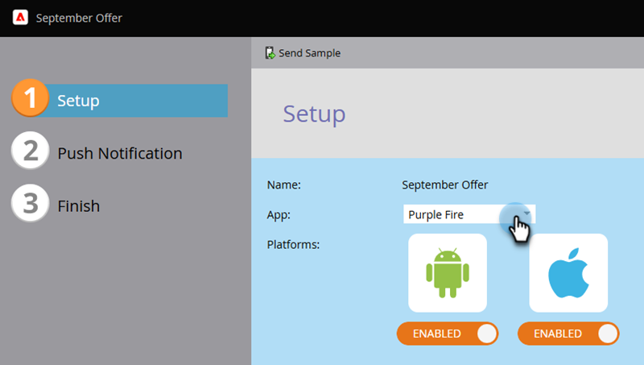

# Configurare notifica push su dispositivo mobile {#configure-mobile-push-notification}

1. Passa alla schermata **[!UICONTROL Marketing Activities]**.

   

1. Seleziona la risorsa push e fai clic su **[!UICONTROL Edit Draft]**.

   

1. In **Configurazione**, seleziona l&#39;app desiderata. Le piattaforme Android e Apple sono abilitate per impostazione predefinita.

   

   >[!NOTE]
   >
   >Se il messaggio push si applica a una sola piattaforma (ad esempio, iOS), puoi escludere l&#39;altra piattaforma facendo scorrere manualmente il selettore su **Disabilitato**.

1. Fai clic su **[!UICONTROL Next]**.

   

1. Inserisci il testo del messaggio o seleziona l&#39;icona del token per aggiungere i token (in questo editor i token sono formattati [come sono in genere](/help/marketo/product-docs/demand-generation/landing-pages/personalizing-landing-pages/tokens-overview.md) - puoi utilizzare più token). Seleziona **Azione tocco**.

   

   >[!NOTE]
   >
   >Se una piattaforma è abilitata, appare sul lato sinistro dello schermo del telefono. Quando è selezionato, viene visualizzato a colori.

   >[!NOTE]
   >
   >Esistono tre tipi di [!UICONTROL Tap Actions]:
   >
   >**Avvia app** - **Questa app** apre la home page dell&#39;app quando viene toccata la notifica. **Personalizzato** utilizza un collegamento profondo per aprire altre aree dell&#39;app o qualsiasi altra app a cui hai il collegamento (vedi [URI di collegamento profondo](#deep-link-uris) di seguito per i dettagli).
   >
   >**[!UICONTROL Landing Page]** - consente di accedere a una pagina di destinazione di Marketo specificata.
   >
   >**[!UICONTROL External URL]** - consente di accedere a una pagina di destinazione non Marketo.

1. Per inserire un collegamento profondo per un&#39;azione di tocco personalizzata, seleziona **Personalizzato** e immetti l&#39;[URI collegamento profondo](#deep-link-uris) nel campo.

   

1. Per iOS, seleziona la casella di controllo per indicare all’app di riprodurre un suono quando arriva il messaggio. Android riproduce automaticamente il suono.

   

1. Visualizzare l&#39;anteprima dell&#39;altra piattaforma e fare clic su **[!UICONTROL Finish]**.

   

1. Fai clic su **[!UICONTROL Approve and Close]**.

   

La notifica push è pronta per essere inviata.

Se si riceve l&#39;errore: `Limited Access: You do not have sufficient privileges to perform this action`, verificare che l&#39;autorizzazione **Access Design Studio** > `Access Landing Page` sia impostata per l&#39;utente e che sia stata impostata almeno una delle seguenti opzioni:

* Approva notifica push
* Elimina notifica push
* Modifica notifica push

## URI di collegamenti profondi {#deep-link-uris}

Quando gli abbonati fanno clic su un pulsante in un messaggio push, possono accedervi direttamente alla home page dell’app o direttamente a una pagina specifica all’interno dell’app. Un collegamento profondo è un riferimento univoco a una pagina specifica dell’app e ha l’aspetto di un collegamento a un sito web.

Un URI di collegamento profondo è costituito da tre parti: nome dello schema, percorso e identificatore. Nell’esempio seguente, &quot;myappname&quot; è lo schema. &quot;products&quot; è il percorso, mentre &quot;purple-shirt&quot; è l’identificatore. Quando il cliente tocca, questi vengono portati specificamente all’elemento della camicia viola all’interno delle pagine dei prodotti della tua app.

Detto questo, la struttura dei collegamenti profondi dell&#39;app potrebbe essere diversa da quella dell&#39;esempio precedente. Lo sviluppatore dispone di diverse opzioni per la definizione degli URI di collegamento profondo. Chiedi allo sviluppatore di inviarti gli URI (collegamenti) per le pagine che ti interessano. In questo modo gli URI immessi nei messaggi push puntano alle posizioni giuste. Il tuo sviluppatore può [trovare ulteriori informazioni qui](https://experienceleague.adobe.com/en/docs/marketo-developer/marketo/mobile/enabling-deep-links-in-your-app).

>[!MORELIKETHIS]
>
>[Invia una notifica push mobile](/help/marketo/product-docs/mobile-marketing/push-notifications/send-a-mobile-push-notification.md)
