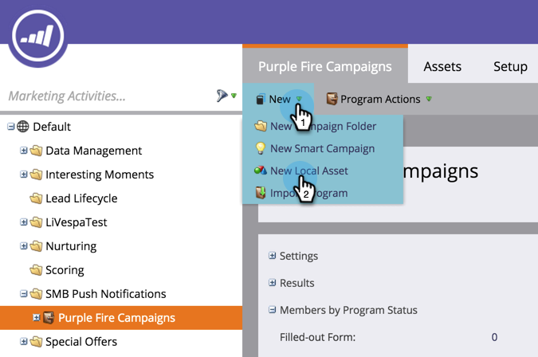

# Creare una notifica push {#create-a-push-notification}

È facile creare una notifica push. Tuttavia, prima di iniziare, è necessario che il tuo responsabile marketing Admin e sviluppatore di app mobili configurino alcune cose che ti servono mentre lo stai facendo. Per informazioni, consultate [Informazioni sulle notifiche push](/help/marketo/product-docs/mobile-marketing/push-notifications/understanding-push-notifications.md).

1. Andate all&#39;area **Attività di marketing**.

   

1. Trova e seleziona il programma.

   

1. In **Nuova**, fare clic su **Nuova risorsa locale**.

   

1. Selezionare **Notifica push**.

   

1. Immettete un **Nome notifica push** e fate clic su **Crea**.

   

   Dolce! Ora che viene creata la notifica push, andiamo avanti e [vestiamola](/help/marketo/product-docs/mobile-marketing/push-notifications/configure-mobile-push-notification.md).
