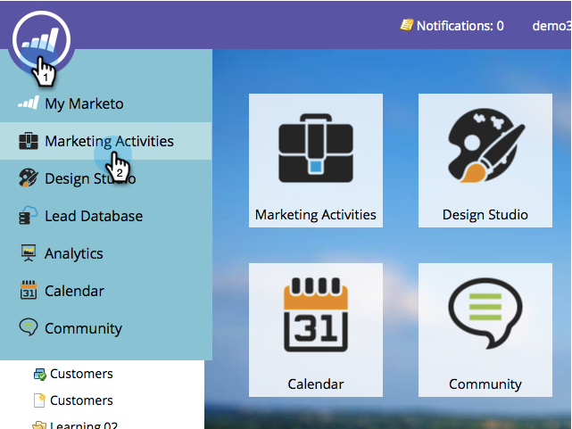

# Elimina notifica push mobile {#delete-mobile-push-notification}

1. Vai a **Attività di marketing** area.

1. Trova e seleziona la notifica push per dispositivi mobili.

   

1. Sotto **Azioni di notifica push**, fai clic su **Elimina**.

   

1. Conferma facendo clic su **Elimina**.

   

   >[!NOTE]
   >
   >Se la notifica push per dispositivi mobili è utilizzata da altre risorse, non potrai eliminarla. Devi andare a rimuoverlo dalle risorse.
