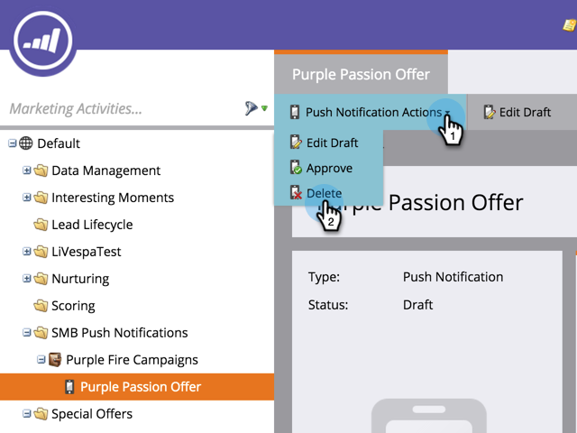

# Elimina notifica push mobile {#delete-mobile-push-notification}

1. Andate all&#39;area **Attività di marketing**.

1. Trova e seleziona la notifica push mobile.

   

1. In **Azioni di notifica push**, fare clic su **Elimina**.

   

1. Confermare facendo clic su **Elimina**.

   

   >[!NOTE]
   >
   >Se la notifica push per dispositivi mobili è utilizzata da altre risorse, non potrai eliminarla. È necessario rimuoverlo dalle risorse.
