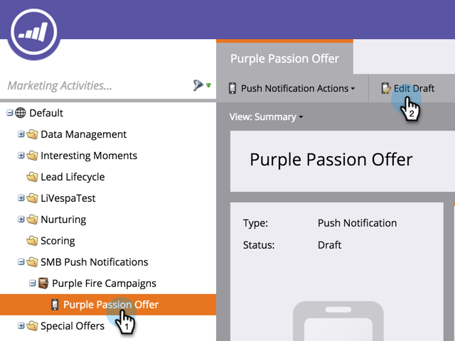

# Modificare notifica push su dispositivo mobile {#edit-mobile-push-notification}

1. Passa alla schermata **[!UICONTROL Marketing Activities]**.

1. Seleziona la tua app mobile e fai clic su **[!UICONTROL Edit Draft]**.

   

>[!MORELIKETHIS]
>
>Ulteriori informazioni sulla [configurazione delle notifiche push](/help/marketo/product-docs/mobile-marketing/push-notifications/configure-mobile-push-notification.md) qui.
