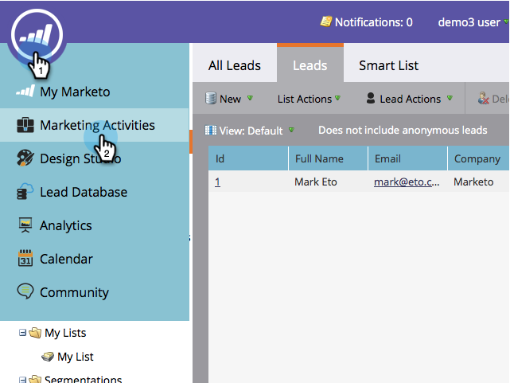

# Invia una notifica push mobile {#send-a-mobile-push-notification}

Inviate una notifica push alle persone che utilizzano la vostra app mobile.

>[!PREREQUISITES]
>
>* [Creare una nuova campagna intelligente](/help/marketo/product-docs/core-marketo-concepts/smart-campaigns/creating-a-smart-campaign/create-a-new-smart-campaign.md)
>* [Creare una notifica push](/help/marketo/product-docs/mobile-marketing/push-notifications/create-a-push-notification.md)

1. Andate all&#39;area **Attività di marketing**.

   

1. Selezionate la campagna intelligente e fate clic su **Smart List**.

   

1. Definite l&#39;elenco smart e fate clic su **Flusso**.

   

1. Selezionate una notifica push. Fare clic su **Schedule**.

   

   >[!NOTE]
   >
   >La notifica push deve essere approvata prima che venga visualizzata nell&#39;elenco a discesa.

1. Fare clic su **Esegui una volta**.

   

1. Scegliete una data e un’ora. Fare clic su **Salva**.

   

Siediti e aspetta che la tua notifica push esca.
