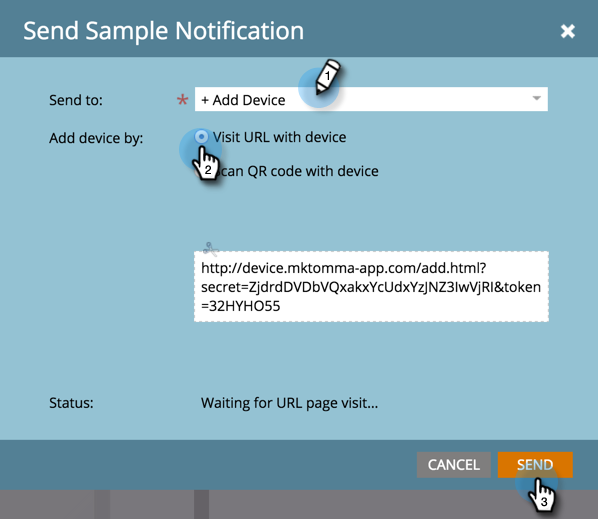

# Invia un esempio di notifica push {#send-a-push-notification-sample}

Puoi inviare un esempio per verificare che la notifica push funzioni correttamente.

>[!PREREQUISITES]
>
>Assicurati che l&#39;app sia installata sul dispositivo a cui stai inviando l&#39;esempio.

1. Puoi inviare un campione in tre modi:

   Nella struttura a sinistra, fai clic con il pulsante destro del mouse sulla risorsa di notifica push e fai clic su **Invia esempio**.

   

   In alternativa, dal menu Azioni notifica push, fai clic su **Invia esempio**.

   

   In alternativa, nell’Editor notifiche push, fai clic su **Invia esempio**.

   

1. Se il dispositivo di prova che si desidera utilizzare è già stato configurato, selezionarlo dall&#39;elenco.

   

   Oppure fai clic su **Aggiungi dispositivo** a [aggiungi un nuovo dispositivo di test](/help/marketo/product-docs/mobile-marketing/push-notifications/adding-a-new-test-device.md) per inviare l&#39;esempio a.

   

1. Puoi collegare il dispositivo all’app in due modi.

   Con la prima opzione, fai clic su **Visita URL con dispositivo** copia l’URL dal campo e invialo tramite e-mail o messaggio di testo al dispositivo. Dal dispositivo, tocca l’URL. Quando lo stato mostra la connessione, fai clic su **Invia**.

   

   Oppure, con la seconda opzione, fai clic su **Scansiona codice QR con dispositivo** e scansionare il codice QR con il dispositivo. Quando lo stato mostra la connessione, fai clic su **Invia**.

   

   >[!TIP]
   >
   >Un dispositivo di test è stato aggiunto correttamente, ma non è elencato in **Invia a** campo? Seleziona questa opzione per risolvere i problemi:
   >
   >* Le notifiche push sono attivate per l’app associata alla notifica push.
   >
   >* La notifica push è configurata per la piattaforma del dispositivo di test. Ad esempio, se hai appena aggiunto un iPhone come dispositivo di test, assicurati che la notifica push sia abilitata per iOS.

Facile!
