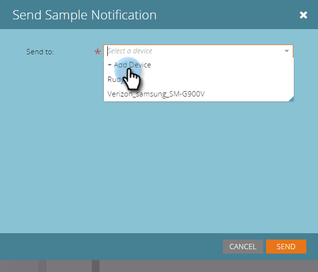

# Invia un esempio di notifica push {#send-a-push-notification-sample}

Potete inviare un esempio per verificare il corretto funzionamento della notifica push!

>[!PREREQUISITES]
>
>Accertatevi che l&#39;app sia installata sul dispositivo a cui state inviando l&#39;esempio.

1. Potete inviare un esempio in tre modi:

   Nella struttura ad albero a sinistra, fate clic con il pulsante destro del mouse sulla risorsa di notifica push e fate clic su **Invia esempio**.

   

   Oppure, dal menu Azioni di notifica push, fai clic su **Invia esempio**.

   

   Oppure, nell&#39;Editor notifiche push, fai clic su **Invia esempio**.

   

1. Se avete già impostato il dispositivo di prova che desiderate utilizzare, selezionatelo dall’elenco.

   

   In alternativa, fare clic su **Aggiungi dispositivo** a [aggiungi un nuovo dispositivo di prova](/help/marketo/product-docs/mobile-marketing/push-notifications/adding-a-new-test-device.md) a cui inviare l&#39;esempio.

   

1. Sono disponibili due modi per collegare il dispositivo all&#39;app.

   Con la prima opzione, fare clic sul pulsante **Visit URL with device**, copiare l&#39;URL dal campo e inviarlo in un messaggio di posta elettronica o di testo al dispositivo. Dal dispositivo, toccate l’URL. Quando lo stato mostra la connessione, fare clic su **Invia**.

   

   Oppure, con la seconda opzione, fare clic sul pulsante **Digitalizza il codice QR con il dispositivo** e analizzare il codice QR con il dispositivo. Quando lo stato mostra la connessione, fare clic su **Invia**.

   

   >[!TIP]
   >
   >È stato aggiunto correttamente un dispositivo di prova, ma non è elencato nel campo **Invia a**? Per risolvere i problemi, controllate i seguenti elementi:
   >
   >* Le notifiche push sono attivate per l&#39;app associata alla notifica push.
      >
      >
   * La notifica push è configurata per la piattaforma del dispositivo di prova. Ad esempio, se avete appena aggiunto un iPhone come dispositivo di prova, accertatevi che la notifica push sia abilitata per iOS.

Facile!
