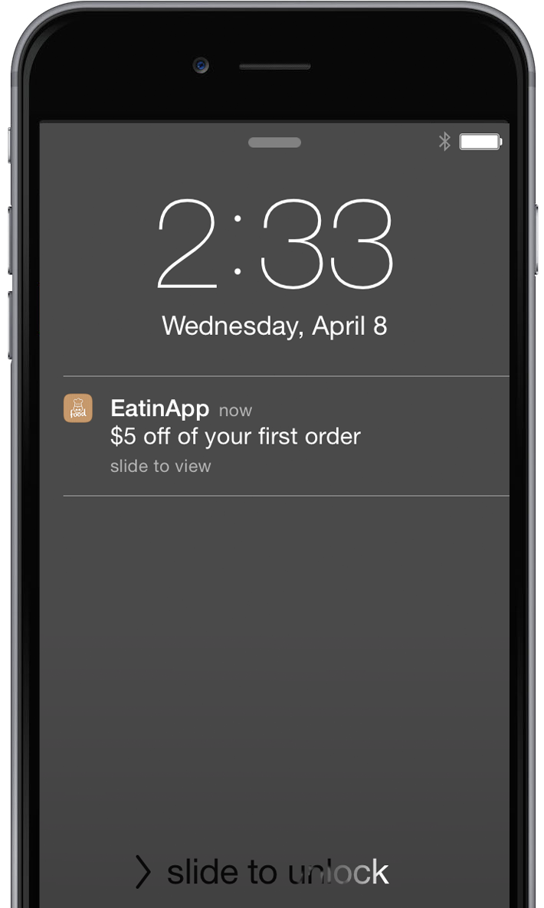

# Informazioni sulle notifiche push {#understanding-push-notifications}

>[!NOTE]
>
>La messaggistica in-app è un’applicazione aggiuntiva. Per verificare che sia attivato, rivolgiti al tuo account manager Marketo.

Marketo mobile engagement consente di creare, configurare e inviare una notifica proprio come si farebbe per creare un’e-mail.  Prima di poter creare e inviare notifiche push dall’app mobile, devi rivolgerti all’amministratore di Marketo e allo sviluppatore di app mobili per eseguire alcune impostazioni.

>[!CAUTION]
>
>Le notifiche push sono un componente aggiuntivo e devono essere attivate da un amministratore Marketo prima di iniziare.

## Passaggio 1: l’amministratore e lo sviluppatore eseguono le impostazioni iniziali {#step-admin-and-developer-perform-initial-setups}

L’amministratore di Marketo e lo sviluppatore di app per dispositivi mobili collaborano per effettuare la configurazione. Per informazioni dettagliate, consulta [Prima di creare notifiche push e messaggi in-app](/help/marketo/product-docs/mobile-marketing/admin/before-you-create-push-notifications-and-in-app-messages.md).

## Passaggio 2: creare una notifica push {#step-create-a-push-notification}

[Crea i tuoi messaggi](/help/marketo/product-docs/mobile-marketing/push-notifications/create-a-push-notification.md) e visualizza in anteprima come vengono visualizzati sui dispositivi Android e iOS.

## Passaggio 3: invia {#step-send}

[Le notifiche push possono essere inviate](/help/marketo/product-docs/mobile-marketing/push-notifications/send-a-mobile-push-notification.md) utilizzando campagne intelligenti di trigger e batch. Fantastico, eh?

>[!NOTE]
>
>* Una notifica push non viene visualizzata sullo schermo fino a quando l’app non viene aperta almeno una volta.
>* Per le app iOS, se l’applicazione designata per ricevere il messaggio push è aperta e attiva, non viene visualizzata una notifica push. Il messaggio verrà invece visualizzato nell’area di notifica locale dell’app.
